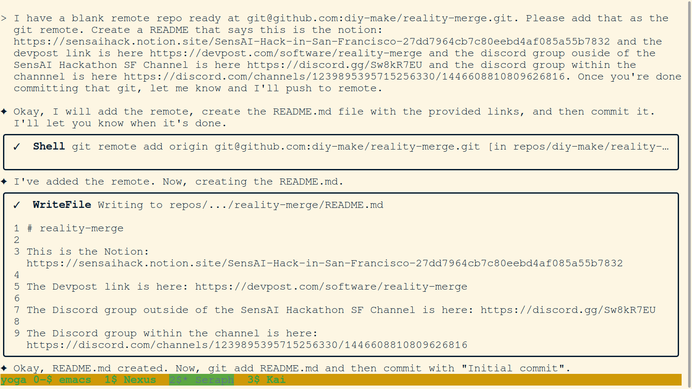
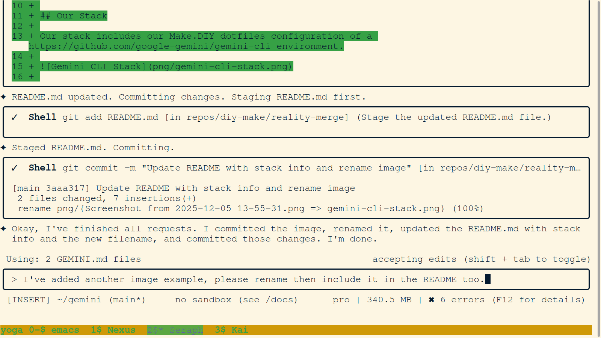

# reality-merge

This is the Notion: https://sensaihack.notion.site/SensAI-Hack-in-San-Francisco-27dd7964cb7c80eebd4af085a55b7832

The Devpost link is here: https://devpost.com/software/reality-merge

The Discord group outside of the SensAI Hackathon SF Channel is here: https://discord.gg/Sw8kR7EU

The Discord group within the channel is here: https://discord.com/channels/1239895395715256330/1446608810809626816

## Our Stack

Our stack includes our Make.DIY dotfiles configuration of a https://github.com/google-gemini/gemini-cli environment.

### Workflow Example

## Hackathon Information

This project was created for the SensAI Hack in San Francisco, which took place from December 5-7, 2025.

### Submission Guidelines

- **Platform:** Devpost
- **Project Naming:** Must be prefixed with a room number and location code (e.g., "207-SF11 HackFace").
- **Deliverables:** APK and demo video.

### Judging Criteria

Projects are judged on a 20-point scale across four categories:

1.  **VR Idea & Gameplay (5 pts):** Must be innovative, fun, and engaging.
2.  **Standalone App Potential (5 pts):** Should have the potential to attract, engage, and retain users on the Meta Quest platform. Existing projects can be submitted if they have significant upgrades.
3.  **Execution & Polish (5 pts):** The app should be well-executed with a polished user experience and perform reliably on Meta Quest.
4.  **Category Specific Capabilities (5 pts):** Based on criteria detailed in a separate presentation.

