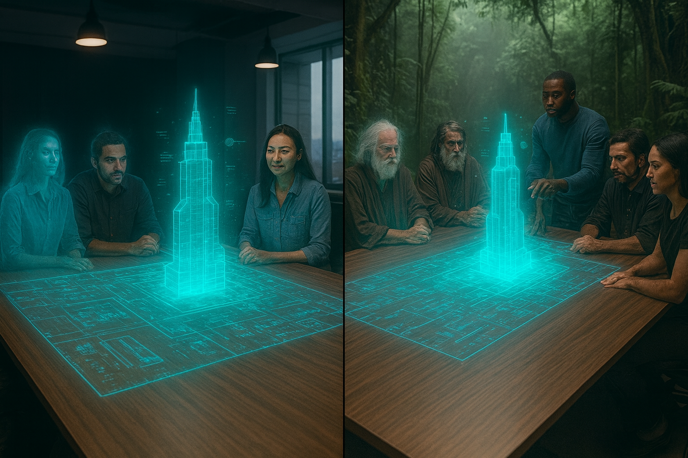
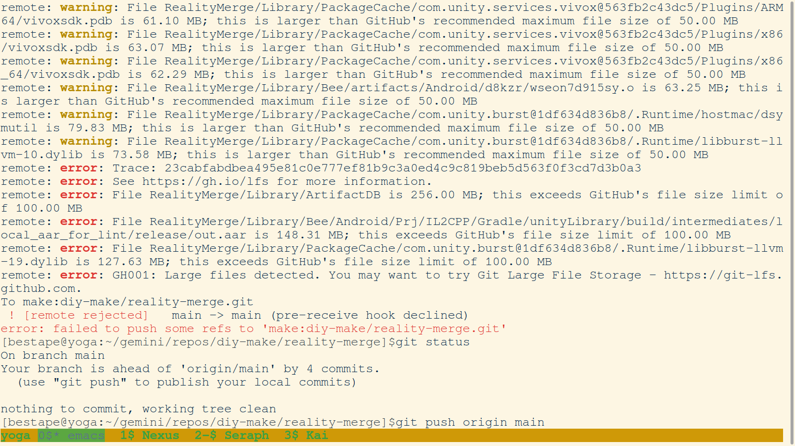
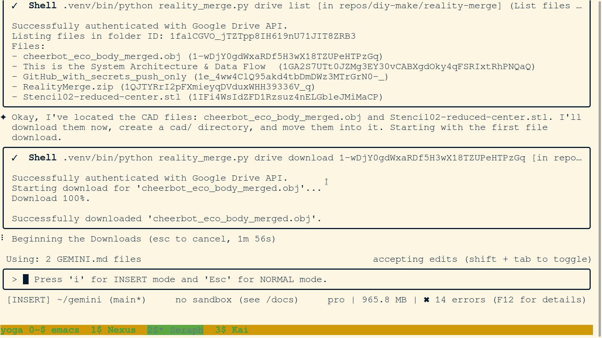
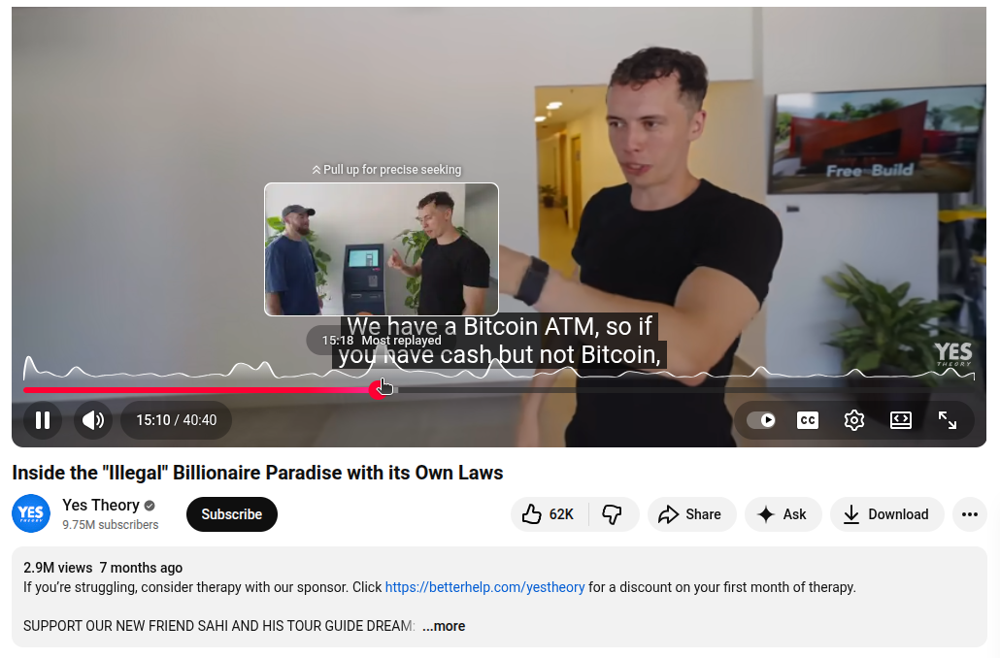
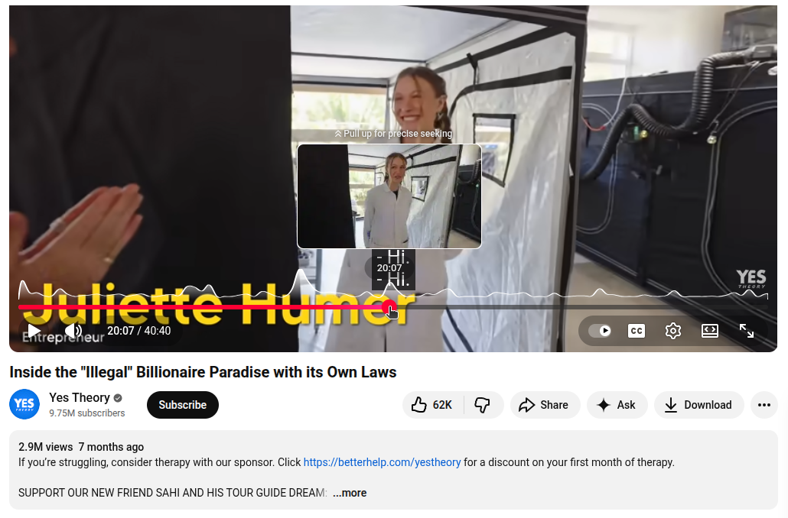

# reality-merge

## The Hackathon Project

This repository contains the plan and supportive infrastructure for the **Reality Merge** hackathon project. The primary goal is to implement a multi-user, mixed-reality shared space based on the architecture outlined in the `md/This_is_the_System_Architecture_&_Data_Flow_.md` document.

The detailed, 12-hour execution plan for the 4-person hackathon team can be found in **[md/gameplan.md](./md/gameplan.md)**.

The subsequent sections of this README detail the **supportive stack** and infrastructure—including the AI/Gemini integration, Google Drive sync, and CLI tools—that have been built to support this effort.

---

## Project Links

- **Notion:** https://sensaihack.notion.site/SensAI-Hack-in-San-Francisco-27dd7964cb7c80eebd4af085a55b7832
- **Devpost:** https://devpost.com/software/reality-merge
- **Discord (Group Outside Channel):** https://discord.gg/pJJtrpJ3Q
- **Discord (Channel):** https://discord.gg/p4RXZ3S8
- **Discord (Group Inside Channel):** https://discord.com/channels/1239895395715256330/1446608810809626816

---

## The Vision: Connecting Makerspaces

**Reality Merge** is a "SensAI hack" inspired by the **Peace Arch Portal System (PAPS)** idea space, which is outlined in the [Portal Panel Proposal](https://github.com/diy-make/portal/blob/main/event/2025/oct/portal_panel_proposal.md). Our goal is to develop a system to connect physical makerspaces, starting with a proof-of-concept and then expanding to a wider network.



### Core Concepts: What is Reality Merge?

**Reality Merge** is the core AI-powered engine of this project. It leverages Large Language Models, specifically Google's Gemini family, to create a "merged reality" from diverse sources of information.

The central concept is the merging of "Shades"—distinct pieces of information, ideas, or project contexts. The system is designed to:
- **Analyze and Understand:** Programmatically fetch and parse information from sources like GitHub README files to understand the "shade" of a given project.
- **Synthesize and Merge:** Use AI to find similarities and create new, synthesized concepts from multiple "shades".
- **Bridge Worlds:** The ultimate goal is to apply this "merged reality" to bridge the gap between different communities and environments, from digital "sim" environments to real-world makerspaces, as envisioned in the Peace Arch Portal System (PAPS) concept.

This AI-driven synthesis is the "SensAI hack" that will power the connection between the makerspaces.

### Technical Baseline: Unity MR Multiplayer Template

This project is built upon the **Unity Mixed Reality Multiplayer Template** as its technical baseline. This template provides the core foundation for creating shared, multi-user mixed reality experiences.

Key features from this template that we are leveraging include:
- **Multiplayer Networking:** Using Netcode for GameObjects and Unity Cloud Services to connect users across different physical locations.
- **Shared Coordinate System:** Allowing users in different rooms (e.g., the 7th and 12th floors of Frontier Tower) to interact with the same virtual objects in a shared space.
- **XR Interaction Toolkit & AR Foundation:** Providing the necessary tools to build for mixed, augmented, and virtual reality, which is essential for "merging" the physical and digital worlds.

This template provides the starting point for implementing the "VR Reference Anchor" and creating a persistent, shared experience between the connected makerspaces.

### Proof-of-Concept & Stretch Goals

- **Proof-of-Concept: Frontier Tower:** The initial proof-of-concept will be implemented at [Frontier Tower](https://frontiertower.io/) in San Francisco, connecting the 7th-floor makerspace with the 12th floor.
- **Stretch Goals:** Once the PoC is successful, our stretch goals are to connect with other makerspaces, including [DUNA Residences](https://www.dunaresidences.com/about) (Honduras), a makerspace in Brazil, and [Founder Haus](https://founderhaus.club/).

---

## Our Key Innovation: Hybrid Cloud for VR Assets

### The Challenge: "VR-Sized" Files

A core challenge in collaborative VR/MR development is managing "VR-sized" assets—3D models, textures, and Unity project files that can be gigabytes in size. For a global network of makerspaces, shipping hard drives is not viable, and standard Git platforms like GitHub have hard limits on file sizes, making them unsuitable for large asset storage. Our attempt to use Git LFS failed for this very reason.


*Evidence of our `git push` failing due to file size limits, a common problem for VR projects on GitHub.*

### The Solution: An AI-Orchestrated Workflow

**Our solution is the heart of this hack:** an AI-orchestrated, hybrid cloud workflow.

We use **GitHub for our code** and **Google Drive for our large assets**. The key innovation is the **AI agent (Seraph)** acting as the conductor of this orchestra. By developing a supportive stack of CLI tools, we have empowered the agent to seamlessly manage this process:
-   **`sync_to_drive.sh`:** A single command that intelligently syncs the entire project, including huge files, to Google Drive.
-   **`reality_merge.py`:** A robust CLI that can list, download, and move files between the cloud and local environments.

This AI-driven orchestration solves a critical problem for distributed creative teams and is the core "SensAI hack" of our project.


*Proof of our custom script successfully handling a large CAD file, validating our hybrid cloud approach.*

---

## Developer Guide

### Development Setup

Before running the application, you need to set up the Python virtual environment and install the required dependencies.

1.  **Run the setup script:**
    ```bash
    sh sh/setup_env.sh
    ```
    This will create a `.venv` directory and install the packages listed in `requirements.txt`.

2.  **Activate the virtual environment:**
    To activate the environment for your current shell session, run:
    ```bash
    source .venv/bin/activate
    ```

### Security: Secret Scanning

This repository uses `detect-secrets` and `pre-commit` to prevent accidentally committing sensitive information.

After setting up the virtual environment with `sh/setup_env.sh`, you should install the git hooks:

```bash
source .venv/bin/activate
pre-commit install
```
This will automatically scan for secrets on every commit. If you intentionally add a file with a secret (like `client_secret.json`), the commit will be blocked. To allow the secret, you need to update the baseline and re-commit:
```bash
.venv/bin/detect-secrets scan > .secrets.baseline
git add .secrets.baseline
```

### Google Drive Setup & Workflow

Setting up OAuth 2.0 is a powerful one-time step that allows our CLI tool to securely access your Google Drive files on your behalf. This unlocks our hybrid cloud workflow.

1.  **Enable APIs:** Go to the [Google Cloud Console](https://console.cloud.google.com/), create or select a project, and enable the **Google Drive API** and the **Google Docs API**.

2.  **Download Credentials:** In the "Credentials" section, click "Create Credentials" > "OAuth client ID". Choose "Desktop app" and download the JSON file. Save it as `client_secret.json` in the root of this project.

3.  **Run Authentication Script:**
    ```bash
    sh sh/authenticate_gdrive.sh
    ```
    This will open a browser window for you to authorize access. After you approve, a `token.json` file will be created.

#### Google Drive Folder Workflow

We use a three-folder system on Google Drive to manage our project's assets:

1.  **`needs_to_be_main_gemini_processed/` (The Inbox):** This is the "todo" queue. Drop files here to be processed. Run `python3 reality_merge.py drive process <folder_id>` to download and delete them.
2.  **`shared_working_environment/` (The Unity Project):** This contains the large, shared `RealityMerge/` Unity project. Run `python3 reality_merge.py drive upload RealityMerge/ --dest shared_working_environment` to sync it.
3.  **`main_gemini_only_including_gitignore/` (The Full Backup):** This is a complete backup of our entire local repository. Run `python3 reality_merge.py drive upload . --dest main_gemini_only_including_gitignore` to sync it.

---

## Appendix

### Our Stack
- Our stack includes our Make.DIY dotfiles configuration of a https://github.com/google-gemini/gemini-cli environment.
- We use `pre-commit` and `detect-secrets` for secret scanning to prevent committing sensitive information to the repository.


### DUNA Makerspace & The YesTheory Feature
The DUNA makerspace, a key inspiration for this project, has gained significant attention from a [YesTheory video](https://youtu.be/pdmVDO0a8dc?si=CVHNPpoDpFWw9GBB&t=904) with nearly 3 million views.



### Hackathon Information
This project was created for the SensAI Hack in San Francisco, which took place from December 5-7, 2025.
- **Platform:** Devpost
- **Project Naming:** Must be prefixed with a room number and location code (e.g., "207-SF11 HackFace").
- **Deliverables:** APK and demo video.
- **Judging Criteria:** Based on a 20-point scale across four categories (Gameplay, Standalone Potential, Polish, and Category Specifics).
