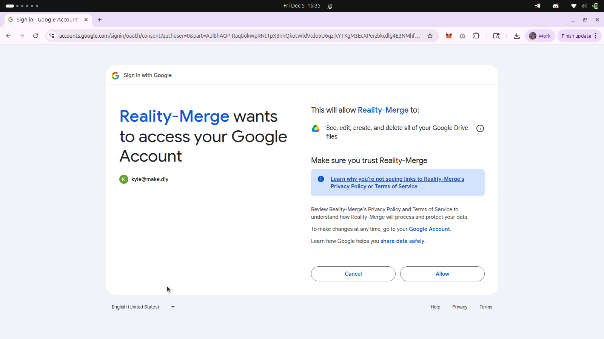
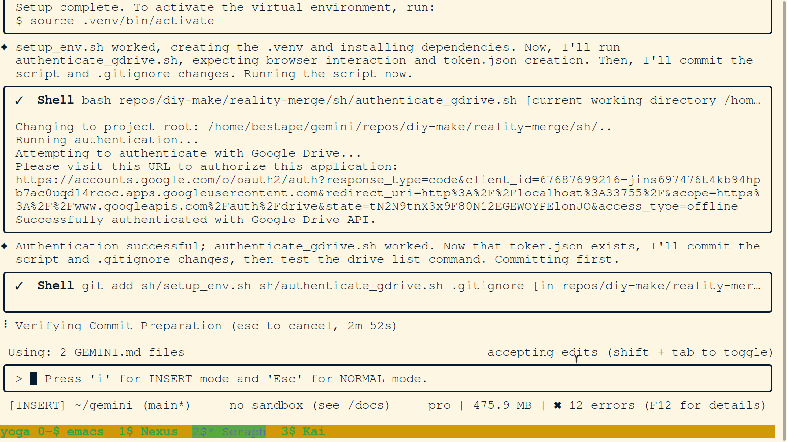
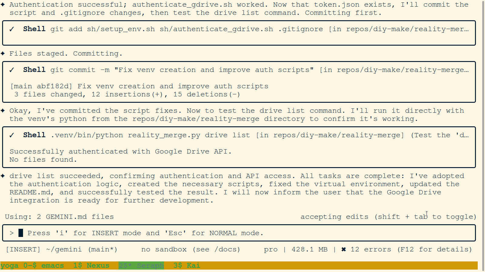

# reality-merge

## The Hackathon Project

This repository contains the plan and supportive infrastructure for the **Reality Merge** hackathon project. The primary goal is to implement a multi-user, mixed-reality shared space based on the architecture outlined in the `md/This_is_the_System_Architecture_&_Data_Flow_.md` document.

The detailed, 12-hour execution plan for the 4-person hackathon team can be found in **[md/gameplan.md](./md/gameplan.md)**.

The subsequent sections of this README detail the **supportive stack** and infrastructure—including the AI/Gemini integration, Google Drive sync, and CLI tools—that have been built to support this effort.

---

## Project: Reality Merge

**Reality Merge** is a "SensAI hack" inspired by the **Peace Arch Portal System (PAPS)** idea space, which is outlined in the [Portal Panel Proposal](https://github.com/diy-make/portal/blob/main/event/2025/oct/portal_panel_proposal.md).

### What is Reality Merge?

**Reality Merge** is the core AI-powered engine of this project. It leverages Large Language Models, specifically Google's Gemini family, to create a "merged reality" from diverse sources of information.

The central concept is the merging of "Shades"—distinct pieces of information, ideas, or project contexts. The system is designed to:
- **Analyze and Understand:** Programmatically fetch and parse information from sources like GitHub README files to understand the "shade" of a given project.
- **Synthesize and Merge:** Use AI to find similarities and create new, synthesized concepts from multiple "shades".
- **Bridge Worlds:** The ultimate goal is to apply this "merged reality" to bridge the gap between different communities and environments, from digital "sim" environments to real-world makerspaces, as envisioned in the Peace Arch Portal System (PAPS) concept.

This AI-driven synthesis is the "SensAI hack" that will power the connection between the makerspaces.

### Technical Baseline: Unity MR Multiplayer Template

This project is built upon the **Unity Mixed Reality Multiplayer Template** as its technical baseline. This template provides the core foundation for creating shared, multi-user mixed reality experiences.

Key features from this template that we are leveraging include:
- **Multiplayer Networking:** Using Netcode for GameObjects and Unity Cloud Services to connect users across different physical locations.
- **Shared Coordinate System:** Allowing users in different rooms (e.g., the 7th and 12th floors of Frontier Tower) to interact with the same virtual objects in a shared space.
- **XR Interaction Toolkit & AR Foundation:** Providing the necessary tools to build for mixed, augmented, and virtual reality, which is essential for "merging" the physical and digital worlds.

This template provides the starting point for implementing the "VR Reference Anchor" and creating a persistent, shared experience between the connected makerspaces.

### Our Solution for "VR-Sized" Files

A core challenge in collaborative VR/MR development is managing "VR-sized" assets—3D models, textures, and Unity project files that can be gigabytes in size. For a global network of makerspaces, shipping hard drives is not viable, and standard Git platforms like GitHub have hard limits on file sizes, making them unsuitable for large asset storage. Our attempt to use Git LFS failed for this very reason.


*Evidence of our `git push` failing due to file size limits, a common problem for VR projects on GitHub.*

**Our solution is the heart of this hack:** an AI-orchestrated, hybrid cloud workflow.

We use **GitHub for our code** and **Google Drive for our large assets**. The key innovation is the **AI agent (Seraph)** acting as the conductor of this orchestra. By developing a supportive stack of CLI tools, we have empowered the agent to seamlessly manage this process:
-   **`sync_to_drive.sh`:** A single command that intelligently syncs the entire project, including huge files, to Google Drive.
-   **`reality_merge.py`:** A robust CLI that can list, download, and move files between the cloud and local environments.

This AI-driven orchestration solves a critical problem for distributed creative teams and is the core "SensAI hack" of our project.


*Proof of our custom script successfully handling a large CAD file, validating our hybrid cloud approach.*


Our goal is to develop a system to connect physical makerspaces, starting with a proof-of-concept and then expanding to a wider network.

### Proof-of-Concept: Frontier Tower

The initial proof-of-concept will be implemented at [Frontier Tower](https://frontiertower.io/) in San Francisco, connecting the 7th-floor makerspace with the 12th floor.

### Stretch Goals

Once the PoC is successful, our stretch goals are to connect with other makerspaces, including:
- [DUNA Residences](https://www.dunaresidences.com/about) (Honduras)
- A makerspace in Brazil.
- [Founder Haus](https://founderhaus.club/)

### DUNA Makerspace & The YesTheory Feature

The DUNA makerspace, a key inspiration for this project, has gained significant attention from a [YesTheory video](https://youtu.be/pdmVDO0a8dc?si=CVHNPpoDpFWw9GBB&t=904) with nearly 3 million views. The video's tour of the makerspace highlights its potential as a hub for innovation.


*A glimpse into the DUNA makerspace from the YesTheory video.*


*Another view of the popular makerspace tour.*

This is the Notion: https://sensaihack.notion.site/SensAI-Hack-in-San-Francisco-27dd7964cb7c80eebd4af085a55b7832

The Devpost link is here: https://devpost.com/software/reality-merge

## Discord Links

- **Group Outside Channel:** https://discord.gg/pJJtrpJ3Q
- **Channel:** https://discord.gg/p4RXZ3S8
- **Group Inside Channel:** https://discord.com/channels/1239895395715256330/1446608810809626816

## Our Stack

- Our stack includes our Make.DIY dotfiles configuration of a https://github.com/google-gemini/gemini-cli environment.
- We use `pre-commit` and `detect-secrets` for secret scanning to prevent committing sensitive information to the repository.


### Workflow Example


## Hackathon Information

This project was created for the SensAI Hack in San Francisco, which took place from December 5-7, 2025.

### Submission Guidelines

- **Platform:** Devpost
- **Project Naming:** Must be prefixed with a room number and location code (e.g., "207-SF11 HackFace").
- **Deliverables:** APK and demo video.

### Judging Criteria

Projects are judged on a 20-point scale across four categories:

1.  **VR Idea & Gameplay (5 pts):** Must be innovative, fun, and engaging.
2.  **Standalone App Potential (5 pts):** Should have the potential to attract, engage, and retain users on the Meta Quest platform. Existing projects can be submitted if they have significant upgrades.
3.  **Execution & Polish (5 pts):** The app should be well-executed with a polished user experience and perform reliably on Meta Quest.
4.  **Category Specific Capabilities (5 pts):** Based on criteria detailed in a separate presentation.

## Development Setup

Before running the application, you need to set up the Python virtual environment and install the required dependencies.

1.  **Run the setup script:**
    ```bash
    sh sh/setup_env.sh
    ```
    This will create a `.venv` directory and install the packages listed in `requirements.txt`.

2.  **Activate the virtual environment:**
    To activate the environment for your current shell session, run:
    ```bash
    source .venv/bin/activate
    ```

## Security: Secret Scanning

This repository uses `detect-secrets` and `pre-commit` to prevent accidentally committing sensitive information.

### Setup

After setting up the virtual environment with `sh/setup_env.sh`, you should install the git hooks:

```bash
source .venv/bin/activate
pre-commit install
```

This will automatically scan for secrets on every commit.

### Handling Secrets

If you intentionally add a file with a secret (like `client_secret.json`), the commit will be blocked. To allow the secret, you need to update the baseline:

```bash
.venv/bin/detect-secrets scan > .secrets.baseline
```

After updating the baseline, you can `git add .secrets.baseline` and re-commit your changes.

## Google Drive Integration

Setting up OAuth 2.0 is a powerful one-time step. It allows this command-line tool to securely access your Google Drive files on your behalf. This unlocks the ability to automate tasks like listing files, downloading assets, and potentially uploading new content directly from your terminal, bridging the gap between your cloud storage and your local development workflow.

### Google Drive Workflow

We use a three-folder system on Google Drive to manage our project's assets, from initial processing to final backup. Our custom CLI tools automate this workflow.

1.  **`needs_to_be_main_gemini_processed/` (The Inbox)**
    -   **Purpose:** This is the "todo" queue. Any team member can drop files here (like raw documents or assets) that need to be processed and brought into the main project.
    -   **Action:** Run `python3 reality_merge.py drive process <folder_id>` to automatically download all files from this folder and then delete them from the Drive, ensuring each file is processed only once.

2.  **`shared_working_environment/` (The Unity Project)**
    -   **Purpose:** This folder contains the large, shared `RealityMerge/` Unity project, allowing team members to stay in sync with the main game assets.
    -   **Action:** Run `python3 reality_merge.py drive upload RealityMerge/ --dest shared_working_environment` to push updates from the local `RealityMerge/` directory to the cloud.

3.  **`main_gemini_only_including_gitignore/` (The Full Backup)**
    -   **Purpose:** This is a complete, one-way backup of our entire local repository, including all scripts, documentation, and files that are normally ignored by Git (like `client_secret.json`). It serves as a disaster recovery snapshot for the project's infrastructure.
    -   **Action:** Run `python3 reality_merge.py drive upload . --dest main_gemini_only_including_gitignore` to sync the entire repository to this folder.

This project can be configured to interact with a Google Drive folder to manage assets.

### Setup

To use this feature, you will need to enable the Google Drive API and get your `client_secret.json` file.

1.  **Enable the Google Drive API:**
    *   Go to the [Google Cloud Console](https://console.cloud.google.com/).
    *   Create a new project or select an existing one.
    *   In the API Library, search for "Google Drive API" and enable it.

2.  **Download `client_secret.json`:**
    *   In the "Credentials" section of the APIs & Services dashboard, click "Create Credentials" and select "OAuth client ID".
    *   Choose "Desktop app" as the application type.
    *   Download the JSON file and save it as `client_secret.json` in the root of this project.

3.  **Run the Authentication Script:**
    *   Execute the following command in your terminal:
        ```bash
        sh sh/authenticate_gdrive.sh
        ```
    *   This will open a browser window for you to authorize access to your Google Drive. After you approve, a `token.json` file will be created.

### Automated Sync

After completing the one-time setup above, you can sync the project to Google Drive at any time by running the following command from the project root:

```bash
bash sync_to_drive.sh
```

This will automatically handle the environment setup, authentication, and one-way "push" sync of the entire project directory.

### CLI Commands

For more granular control, you can use the following low-level commands after activating the virtual environment (`source .venv/bin/activate`):

*   `python3 reality_merge.py drive list`: List the files in the project's root Google Drive folder.
*   `python3 reality_merge.py drive download <file_id>`: Download a file from Google Drive by its ID.

### Setup in Action

1.  **OAuth Consent Screen:** The authentication script will prompt you to authorize the application in your browser.
    

2.  **Authentication Script Execution:** The script will provide a URL and confirm success in the terminal.
    

3.  **CLI Command Test:** A successful test of the `drive list` command confirms the integration is working.
    


