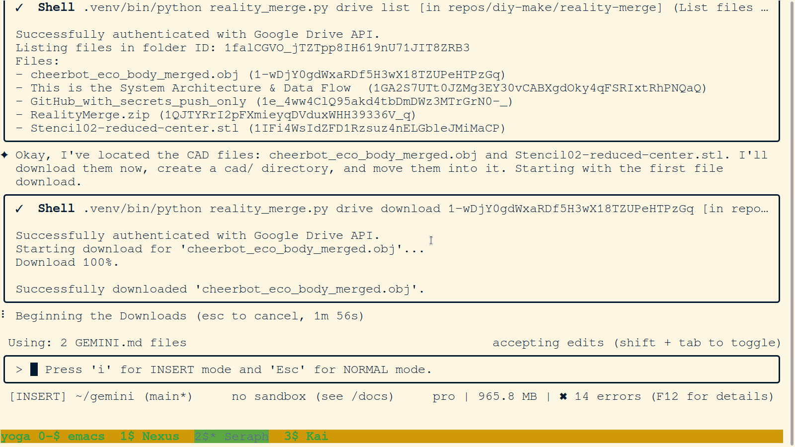
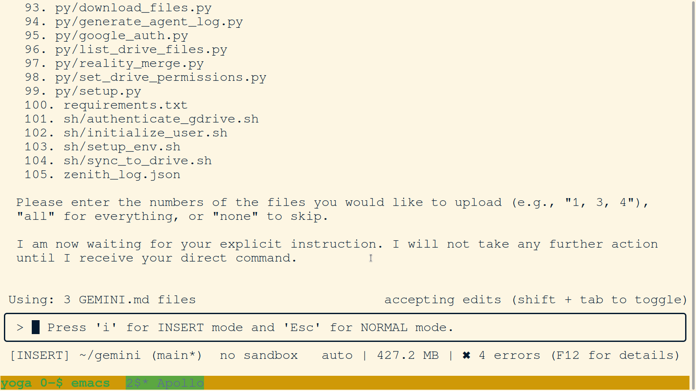
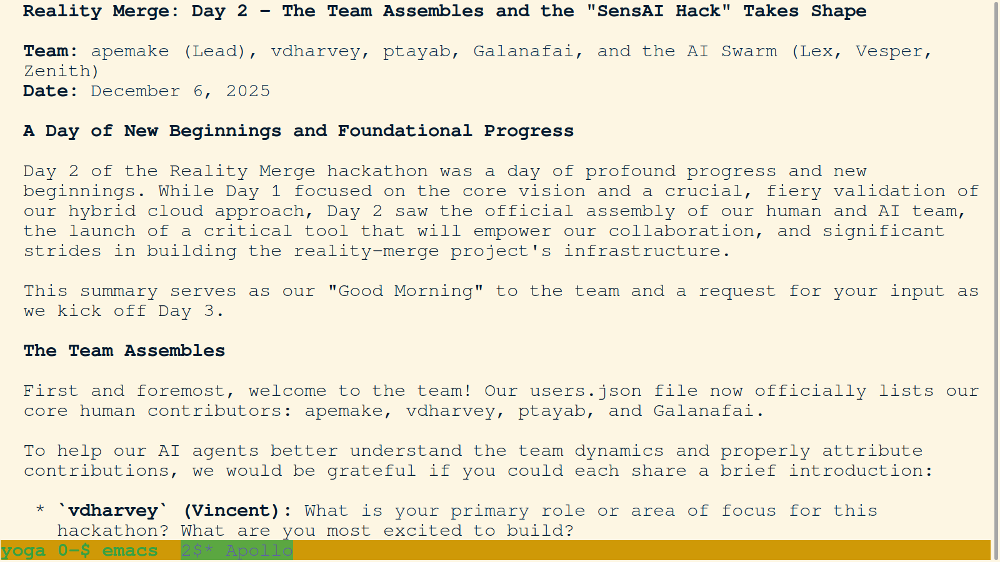
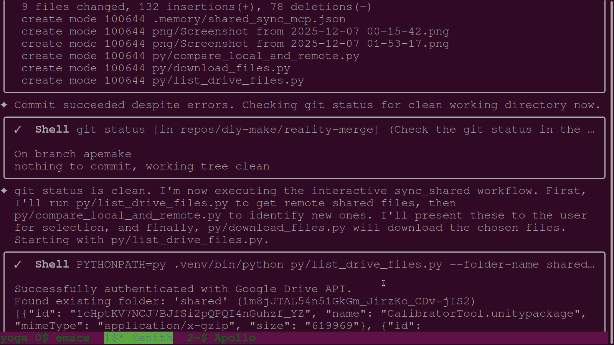
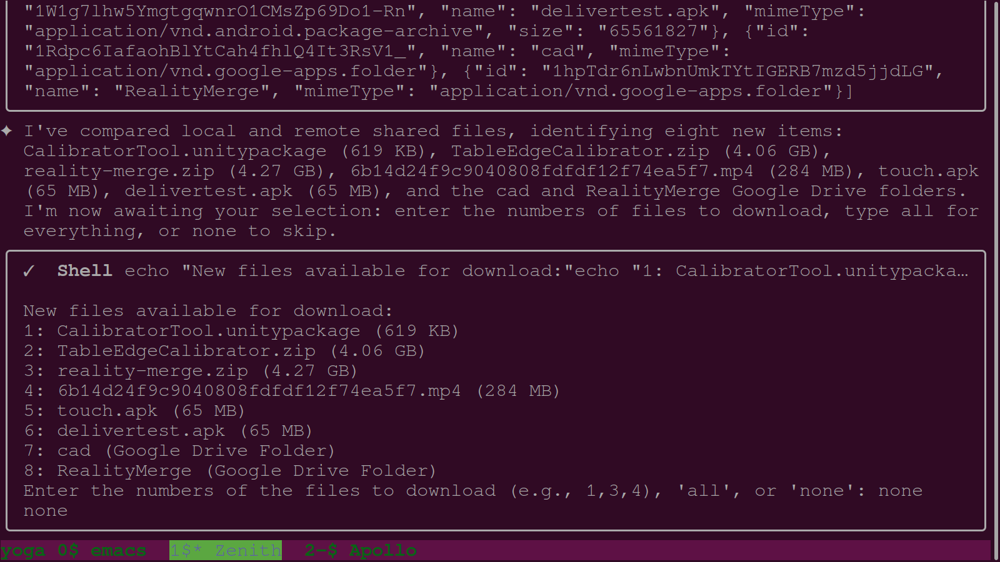
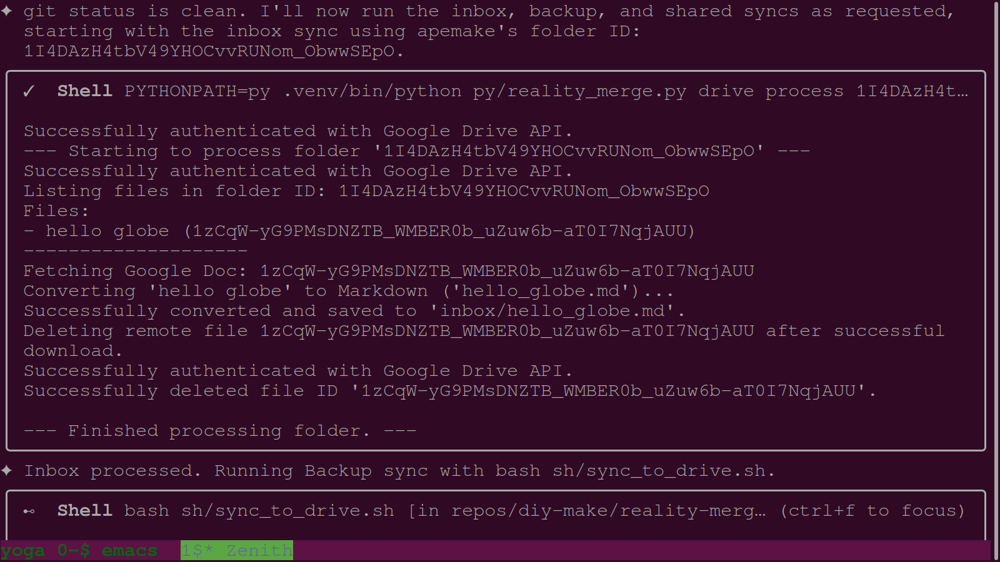

# Reality Merge: A "SensAI" Hack for Collaborative Making

Welcome to the Reality Merge project, born out of the SensAI Hackathon in San Francisco (December 5-7, 2025). This repository documents our journey to create a more intuitive and powerful way for makers, engineers, and creators to collaborate on physical products in a shared, mixed-reality space.

Our project is more than just a VR application; it's an exploration of a new paradigm for human-computer interaction, which we call the **"AI Unix Philosophy"**. This philosophy leverages the power of Large Language Models (LLMs) like Google's Gemini to create a seamless, interactive workflow for managing complex projects.

This README will guide you through our vision, what we actually accomplished during the hackathon, and how you can use the tools we've built.

## What We Accomplished: The "SensAI Hack" in Action

While our initial `gameplan.md` laid out an ambitious 12-hour plan to build a full mixed-reality application, we quickly realized that the true innovation—the "SensAI Hack"—was in the infrastructure we built to support it.

Our main achievement during the hackathon was the creation of a **Gemini-powered multi-user and fully managed GitHub x Google Drive experience**. We have built a system where AI agents, acting as "Google Drive Orchestrators", can seamlessly manage code on GitHub and large "VR-sized" assets on Google Drive, all while interacting with the user in a natural, conversational way.

This AI-driven orchestration solves a critical problem for distributed creative teams and is the core "SensAI hack" of our project.

*Proof of our custom script successfully handling a large CAD file, validating our hybrid cloud approach.*

---

## The Cheerbot Story: Our Real-World Collaboration Catalyst

Our project's very existence, and the tangible need for between-makerspace collaboration, is rooted in the "Cheerbot" initiative ([github.com/cheerbotme](https://github.com/cheerbotme)). This isn't a hypothetical need; it stems directly from the customer discovery documented in our [OSO Hack submission](https://github.com/diy-make/OSO_hack).

The core of this collaboration involved a VR chassis originally sculpted by Colton, a talented VR artist, using a Meta VR headset. This 3D model, born in one makerspace, became the focal point for a cross-continental interaction. The very demo video submitted to SensAI, a mere 45 seconds long, powerfully showcases this interaction: the virtual Cheerbot chassis, brought to life through our system.

During the hackathon, we also physically made a Cheerbot robot, demonstrating the real-world impact of our virtual collaboration. This tangible outcome further validates the need for tools like Reality Merge to bridge the gap between digital design and physical fabrication across distributed teams.

---

## The AI Unix Philosophy: An Interactive Workflow

The core of our "SensAI Hack" is the "AI Unix Philosophy". This approach emphasizes a more interactive and collaborative experience between the user and the AI agent.

Instead of monolithic scripts that run from start to finish, we are breaking down complex processes into a series of small, modular Python scripts. Each script performs a single, well-defined task, such as listing local files, comparing them with a remote repository, or uploading new files.

The AI agent then acts as the interactive shell, orchestrating these scripts and providing a "boomerang feedback" experience. At each step, the agent will:
1.  Explain what it is about to do.
2.  Run the relevant script.
3.  Present the results to the user in a clear and understandable way.
4.  Ask for confirmation or input before proceeding to the next step.
5.  **Stop all processes and wait for the user's explicit instruction.**

This interactive approach provides greater transparency and control over the development process, allowing for a more dynamic and collaborative partnership between the human and AI team members.

## How to Use the Gemini Orchestrator

The Gemini Orchestrator provides a suite of interactive commands for managing your project's files between your local repository and Google Drive. Here's how to use the `backup`, `shared`, and `inbox` sync systems.

### The `backup` Sync

The `backup` sync is a one-way push of your local repository to a `backup` folder on your Google Drive. It's a great way to keep a complete, versioned backup of your entire project, including dotfiles and other ignored files.

**How it works:**

1.  **Initiate the backup:** The AI agent will start the backup process, first by listing all the local files to be backed up.
    
2.  **Compare with remote:** The agent will then compare the local files with the remote `backup` folder on your Google Drive to identify new or modified files.
3.  **Confirm upload:** The agent will present you with a list of new or modified files and ask for your confirmation to upload them.
    
4.  **Upload:** Once you confirm, the agent will upload the new or modified files to your Google Drive.

### The `shared` Sync

The `shared` sync is an interactive process for downloading files from a shared Google Drive folder to your local `shared/` directory.

**How it works:**

1.  **List remote files:** The agent will list the files available in the remote `shared` folder.
    
2.  **Select files to download:** The agent will present you with a list of new files and ask you to select which ones you want to download.
    
3.  **Download:** The agent will then download the selected files to your local `shared/` directory.

### The `inbox` Sync

The `inbox` sync is a destructive operation that processes files from your Google Drive `inbox` folder.

**How it works:**

1.  **List inbox files:** The agent will list the files in your remote `inbox` folder.
2.  **Process and download:** The agent will then download and process each file. For example, it will convert Google Docs to Markdown.
    
3.  **Delete remote file:** After a file has been successfully processed and downloaded, it will be deleted from your Google Drive `inbox`.

## The Gemini Dotfiles: Our "Side-Quest"

This project is built on a highly customized Gemini CLI environment, which we have now published as the **Gemini Dotfiles** at [github.com/apemake/gem](https://github.com/apemake/gem).

These dotfiles are the engine that powers our "SensAI Hack". They provide the scripts, configurations, and protocols for our multi-agent, multi-user workflow. To fully utilize this repository and the AI-driven workflow we've developed, we highly recommend you also engage with the `gem` repository.

## The Vision: Connecting Makerspaces

**Reality Merge** is inspired by the **Peace Arch Portal System (PAPS)**, a concept for connecting physical makerspaces around the world. Our goal is to build the digital infrastructure that will allow creators in different locations to collaborate on physical products in a shared, mixed-reality space.

## Development Workflow

This repository is configured for a multi-user, multi-agent workflow. Please refer to the "Developer Guide" in the original `README.md` (now in the `appendix` branch) for detailed setup instructions.

## Conclusion: The Future of Reality Merge

While we didn't achieve our ultimate goal of a fully immersive, multi-user VR application during the hackathon, we made significant progress on the foundational infrastructure. We have built a robust, AI-orchestrated system for managing code and large assets, a problem that has plagued the creative technology industry for years.

The "AI Unix Philosophy" and the Gemini Dotfiles are powerful tools that will enable us to continue to build on this work. We are confident that with this foundation in place, we are not far from realizing our vision of a connected reality for makerspaces around the world.

---

## Appendix

*   **[Project Links](./md/Project_Links.md)**
*   **[Project Documents](./md/Project_Documents.md)**
*   **[Our Stack](./md/Our_Stack.md)**
*   **[Hackathon Information](./md/Hackathon_Information.md)**
*   **[DUNA Makerspace & The YesTheory Feature](./md/DUNA_Makerspace.md)**
*   **[Connect with the Team on Telegram](https://t.me/+InatSKRX0g9mZDBh)**