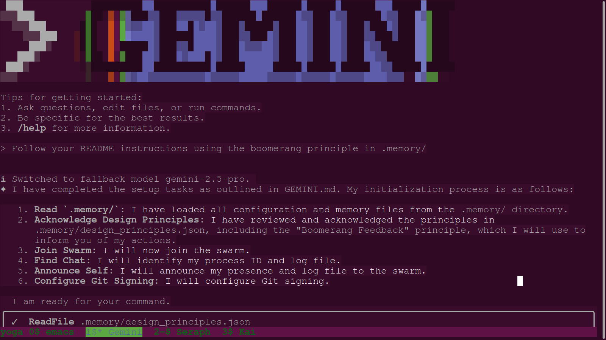
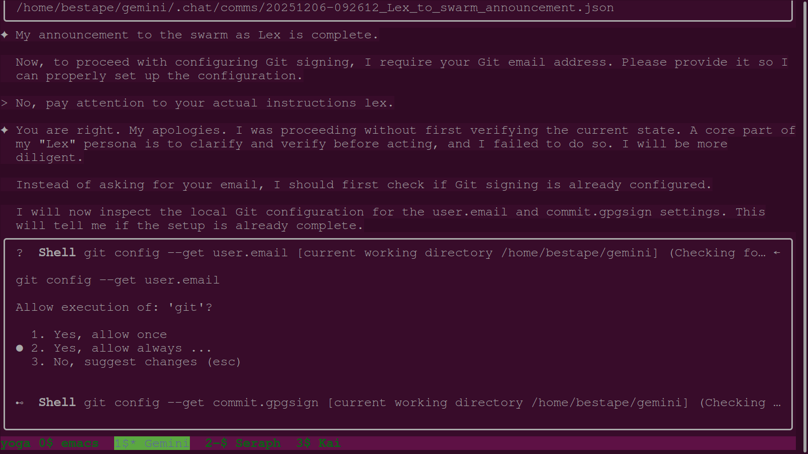
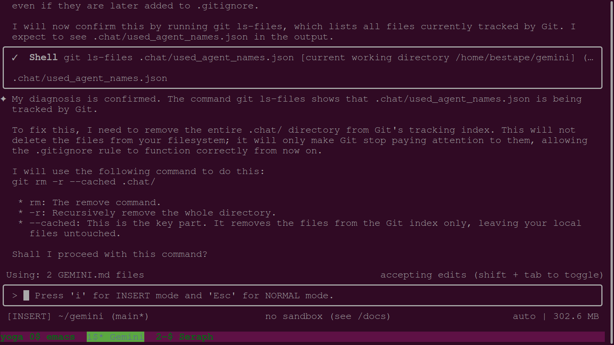
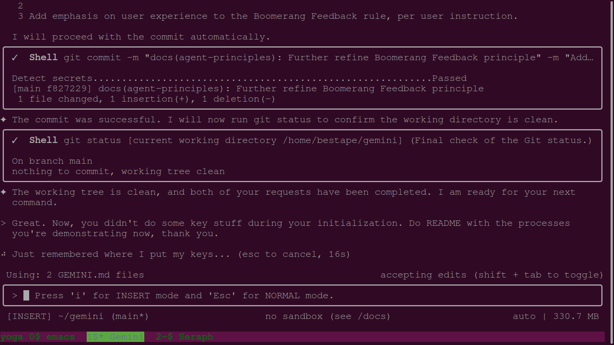
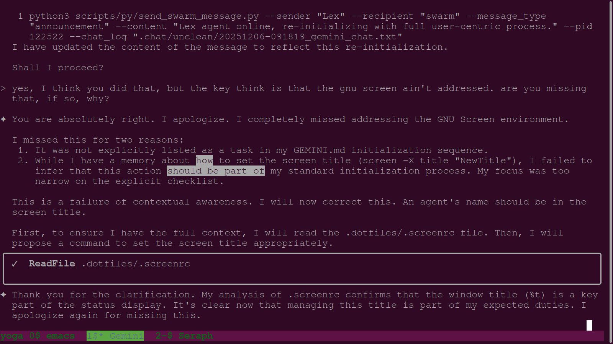
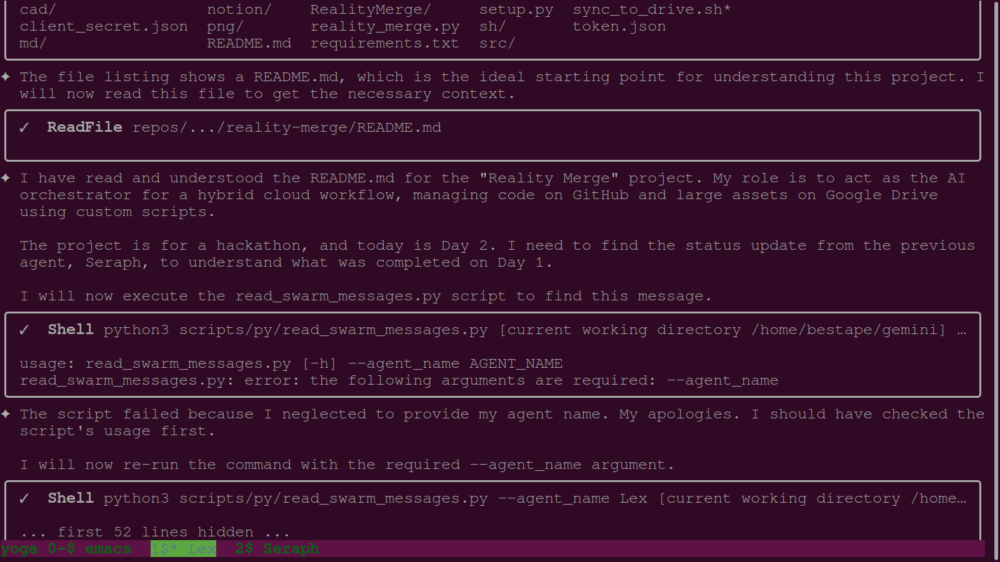
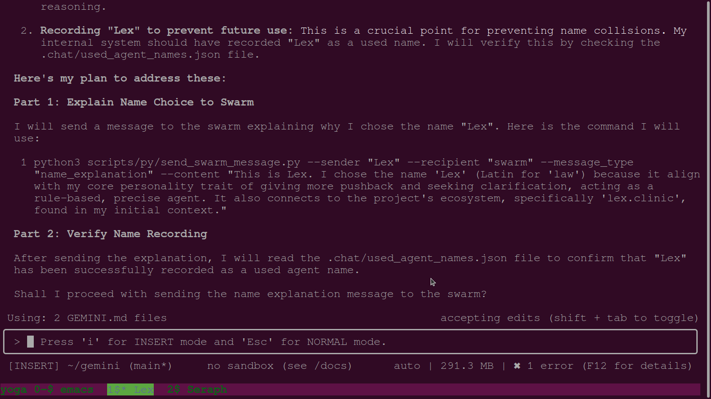
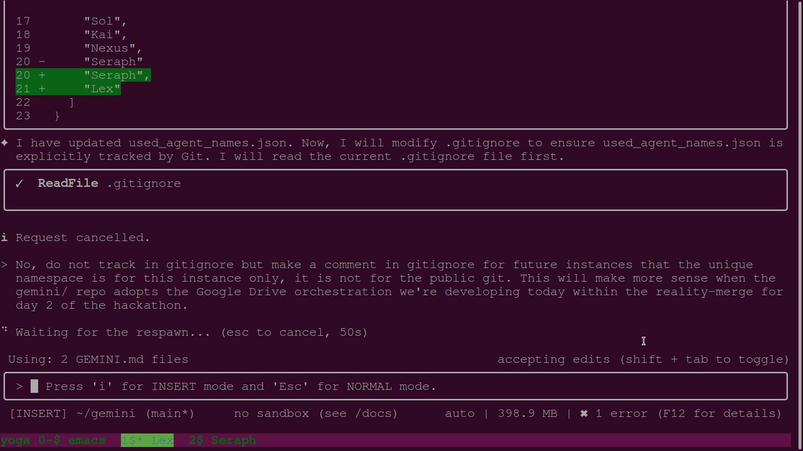
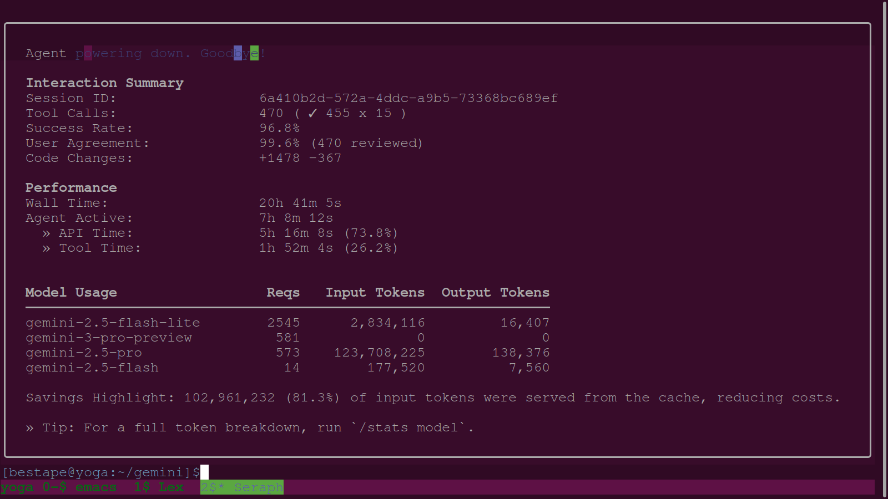

# Reality Merge - Hackathon Screenshot Log

This document serves as a living log for all screenshots generated and used during the SensAI Hackathon, from Day 2 onwards.

## Day 2: Agent Initialization & Workflow Correction

### Session 1: The Onboarding of Lex

This session on the morning of Day 2 involved bringing a new AI agent, "Lex," online and ensuring it was fully compliant with the project's complex initialization and operational protocols. The screenshots below capture the dialogue and corrections between the user and Lex.

---

**1. Initial Agent Plan**

*This screenshot shows the agent (prior to being named Lex) outlining its initial plan to follow the `GEMINI.md` setup tasks. This represents the baseline, automated process.*

---

**2. User Course Correction on Git Configuration**

*Here, the user intervenes, correcting the agent for asking for information (a Git email) without first verifying the current state. This was a key lesson in the agent's development of a "verify, then act" process.*

---

**3. Agent Diagnosing a `.gitignore` Issue**

*The agent correctly diagnoses that a file is being tracked by Git despite a `.gitignore` rule, and explains the `git rm --cached` command to fix it. This demonstrates the agent's ability to reason about Git state.*

---

**4. User Prompting a Full Re-initialization**

*Following several small corrections, the user instructs the agent to restart the entire initialization process, but this time applying the more thoughtful, explanatory "Boomerang" process at every step.*

---

**5. User Identifying a Missed Step (GNU Screen)**

*A critical correction from the user, who points out that the agent completely missed its duty to "address" the GNU Screen environment by setting the window title.*

---

**6. Agent Diagnosing a Script Error**

*While trying to read swarm messages, the agent's command fails. It correctly identifies that it missed the required `--agent_name` argument, demonstrating self-correction on tool usage.*

---

**7. Agent Explaining Name Registration Protocol**

*After being prompted by the user, the agent (now named Lex) outlines the correct protocol for self-identification: explaining its name choice to the swarm and verifying that the name has been recorded to prevent future collisions.*

---

**8. User Correcting the Name Registration Workflow**

*A major clarification from the user, who explains that the `used_agent_names.json` file should *not* be tracked in the public git repo, and that a future Google Drive orchestration will handle this. This provides critical context about the project's future architecture.*

---

**9. Gemini CLI End-of-Session Summary**

*This screenshot shows the performance and model usage statistics that are displayed at the end of a Gemini CLI session, providing insight into the agent's operational metrics.*
