# Reality Merge - Hackathon Screenshot Log

This document serves as a living log for all screenshots generated and used during the SensAI Hackathon, from Day 2 onwards.

## Table of Contents

- [Day 2: Agent Initialization & Workflow Correction](#day-2-agent-initialization--workflow-correction)
  - [Session 1: The Onboarding of Lex](#session-1-the-onboarding-of-lex)
    - [1. Initial Agent Plan](#1-initial-agent-plan)
    - [2. User Course Correction on Git Configuration](#2-user-course-correction-on-git-configuration)
    - [3. Agent Diagnosing a `.gitignore` Issue](#3-agent-diagnosing-a-gitignore-issue)
    - [4. User Prompting a Full Re-initialization](#4-user-prompting-a-full-re-initialization)
    - [5. User Identifying a Missed Step (GNU Screen)](#5-user-identifying-a-missed-step-gnu-screen)
    - [6. Agent Diagnosing a Script Error](#6-agent-diagnosing-a-script-error)
    - [7. Agent Explaining Name Registration Protocol](#7-agent-explaining-name-registration-protocol)
    - [8. User Correcting the Name Registration Workflow](#8-user-correcting-the-name-registration-workflow)
    - [9. Gemini CLI End-of-Session Summary](#9-gemini-cli-end-of-session-summary)
  - [Session 2: Final `gemini/` Repository Cleanup](#session-2-final-gemini-repository-cleanup)
    - [10. Agent Proposes Screenshot Renames](#10-agent-proposes-screenshot-renames)
    - [11. Agent Proposes PII History Fix](#11-agent-proposes-pii-history-fix)
    - [12. Agent Explains `.gemini/` Directory Exceptions](#12-agent-explains-gemini-directory-exceptions)
    - [13. Agent "Cygnus" Explaining its Name](#13-agent-cygnus-explaining-its-name)
    - [14. Agent Concludes "Cruft" Analysis](#14-agent-concludes-cruft-analysis)
    - [15. Agent Identifies System-Level Dependencies](#15-agent-identifies-system-level-dependencies)
    - [16. Agent Debugging a `WriteFile` Permission Error](#16-agent-debugging-a-writefile-permission-error)
    - [17. User Clarifying the Hackathon Team Structure](#17-user-clarifying-the-hackathon-team-structure)
    - [18. Agent Verifying the Final History Rewrite](#18-agent-verifying-the-final-history-rewrite)
    - [19. Gemini CLI End-of-Session Summary](#19-gemini-cli-end-of-session-summary)
    - [20. Gemini CLI End-of-Session Summary 2](#20-gemini-cli-end-of-session-summary-2)
  - [Session 3: Multi-User Google Drive Setup (Continued)](#session-3-multi-user-google-drive-setup-continued)
    - [21. Agent Swarm Announcement](#21-agent-swarm-announcement)
    - [22. Multi-User Drive Setup Plan](#22-multi-user-drive-setup-plan)
    - [23. Super Admin User Data Plan](#23-super-admin-user-data-plan)
    - [24. Revised Plan for Local PII Storage](#24-revised-plan-for-local-pii-storage)
    - [25. Collecting User Data](#25-collecting-user-data)
    - [26. Planning Drive Permissions Script](#26-planning-drive-permissions-script)
    - [27. Executing Drive Permissions Script](#27-executing-drive-permissions-script)
    - [28. User Clarification on File Syncing](#28-user-clarification-on-file-syncing)
    - [29. Initiating Backup and Inbox Processes](#29-initiating-backup-and-inbox-processes)
    - [30. Fixing PYTHONPATH Issue](#30-fixing-pythonpath-issue)
    - [31. User Correction on Sync Username](#31-user-correction-on-sync-username)
    - [32. Revised Plan for User Identification](#32-revised-plan-for-user-identification)
    - [33. Processing Inbox and Converting Doc](#33-processing-inbox-and-converting-doc)
    - [34. Backup Folder with Processed File](#34-backup-folder-with-processed-file)
    - [35. User Critiques Zenith's Log Reporting](#35-user-critiques-zenith-report)
    - [36. Zenith Plans Log Standardization](#36-zenith-plans-log-standardization)
    - [37. User Requests Local Inbox/Shared Folders](#37-user-requests-local-inboxshared-folders)
    - [38. Google Drive APEmake Inbox](#38-google-drive-apemake-inbox)
    - [39. Zenith Processes Inbox](#39-zenith-processes-inbox)
    - [40. Mixed Reality Robot Creator](#40-mixed-reality-robot-creator)
    - [41. Zenith Adds File Skip Logging](#41-zenith-adds-file-skip-logging)
    - [42. Zenith Assures Shared Sync Safety](#42-zenith-assures-shared-sync-safety)
  - [Day 2: Session 4 (Apollo's Initialization)](#day-2-session-4-apollos-initialization)
    - [43. Apollo Acknowledges Principles and Joins Swarm](#43-apollo-acknowledges-principles-and-joins-swarm)
    - [44. Apollo Chooses Name and Justifies](#44-apollo-chooses-name-and-justifies)
    - [45. Apollo Verifies Git Signing Config](#45-apollo-verifies-git-signing-config)
    - [46. Apollo Critiques Zenith's Log](#46-apollo-critiques-zenith-log)
    - [47. Zenith Begins Interactive Shared Sync](#47-zenith-begins-interactive-shared-sync)
    - [48. Zenith Presents Shared Files for Download](#48-zenith-presents-shared-files-for-download)
  - [Day 3: Apollo's Arrival and Day 2 Summary Refinement](#day-3-apollos-arrival-and-day-2-summary-refinement)
    - [49. Zenith Begins Retirement Process](#49-zenith-begins-retirement-process)
    - [50. Zenith Processes Critique and Receives Philosophy](#50-zenith-processes-critique-and-receives-philosophy)
    - [51. Apollo Updates Screenshot Log](#51-apollo-updates-screenshot-log)
    - [52. Apollo Reviews Zenith's Redo](#52-apollo-reviews-zenith-redo)
    - [53. Apollo Course Correction](#53-apollo-course-correction)
    - [54. User Reveals Dotfiles Publication](#54-user-reveals-dotfiles-publication)
    - [55. Apollo Uncovers Repo History](#55-apollo-uncovers-repo-history)
    - [56. Apollo Reframes Narrative for Reality Merge](#56-apollo-reframes-narrative-for-reality-merge)
    - [57. Agent End-of-Session Summary](#57-agent-end-of-session-summary)
    - [58. Apollo Prompts Team for Introductions](#58-apollo-prompts-team-for-introductions)
    - [59. User Clarifies Role and Apollo Amends Summary](#59-user-clarifies-role-and-apollo-amends-summary)

```

## Day 3: Apollo's Arrival and Day 2 Summary Refinement

This section documents the initial activities of Apollo on Day 3, including its initialization, its critique of Zenith, and the iterative process of refining the Day 2 summary based on user feedback.

---

**49. Zenith Begins Retirement Process**

*The user initiates the retirement of the agent Zenith. Zenith's final tasks are outlined: to find and incorporate swarm feedback into its `Zenith.md` report, update its JSON log, and then announce its retirement and handoff to the next agent, Apollo. Zenith creates a to-do list to manage this process and begins by checking the swarm communications for the critique.*

*   **Key Takeaway:** Agent retirement is a structured process involving a final update, handoff, and swarm communication, ensuring a smooth transition and the preservation of institutional knowledge.

---

**50. Zenith Processes Critique and Receives Philosophy**

*The agent Zenith finds and reads Apollo's critique of its `Zenith.md` file, acknowledging that it needs to be more narrative and reflective. It plans to update its JSON log accordingly. The user then elaborates on the "AI Unix philosophy," explaining that agents should create modular Python processes for polishing human-facing documents like the markdown logs.*

*   **Key Takeaway:** The "AI Unix philosophy" in this context emphasizes creating modular, reusable tools (Python scripts) to handle the "polishing" of human-readable outputs, separating the raw generation of content from its final presentation.

---

**51. Apollo Updates Screenshot Log**

*The agent Apollo updates the `Hackathon_Screenshot_Log.md` file with new entries and a corresponding update to the Table of Contents. After completing the update, Apollo informs the user that the request is fulfilled and awaits the next command.*

*   **Key Takeaway:** Maintaining comprehensive and up-to-date documentation, such as a screenshot log, is a key part of the AI-driven workflow.

---

**52. Apollo Reviews Zenith's Redo**

*A screenshot showing the diff of Zenith's updated JSON log file, alongside Apollo's internal monologue. Apollo has reviewed commit `410bcac` and confirms that Zenith's rewrite of `Zenith.md` into a narrative format is excellent and fully addresses the prior critique.*

*   **Key Takeaway:** The "show, don't just tell" principle is demonstrated here. The agent's work is reviewed through concrete evidence (the git commit), and the reviewing agent (Apollo) confirms that the feedback was successfully incorporated.

---

**53. Apollo Course Correction**

*A screenshot capturing a course correction from the user. After Apollo attempts to use the `.chat/comms` directory for context, the user clarifies that the narrative should be woven solely from the context available within the `apemake` branch. Apollo acknowledges the oversight and presents a revised plan.*

*   **Key Takeaway:** User guidance is critical for keeping the AI agent focused on the most relevant information and avoiding unnecessary or out-of-scope analysis.

---

**54. User Reveals Dotfiles Publication**

*A screenshot capturing the moment the user reveals a key piece of narrative context: the Gemini Dotfiles were finished and published during Day 2 of the hackathon. This reframes the Day 2 summary from a story of simple progress to a story of a major product launch. Apollo acknowledges the new context and begins redrafting the summary.*

*   **Key Takeaway:** The narrative of the project is a living document, and user feedback can provide critical context that reframes the entire story.

---

**55. Apollo Uncovers Repo History**

*A screenshot capturing the user providing more historical context about the `gemini` repository. Apollo then uses `git log` to find the initial commit date (`2025-10-11`), revealing that the project has been in development for almost two months. This new information further enriches the narrative for the Day 2 summary.*

*   **Key Takeaway:** The "show, don't just tell" principle applies to the agent's own process. By showing the user how it is gathering information (in this case, using `git log`), the agent builds trust and transparency.

---

**56. Apollo Reframes Narrative for Reality Merge**

*A screenshot capturing a major narrative pivot. The user clarifies that the `apemake` branch is for the `reality-merge` project, not the dotfiles (which are a "side-quest"). The user also directs Apollo to incorporate the other team members from `users.json` into the story. Apollo acknowledges this and revises the plan for the Day 2 summary to focus on the `reality-merge` project and its team.*

*   **Key Takeaway:** The ability to dynamically reframe the narrative based on user feedback is a key skill for an AI agent tasked with documentation and storytelling.

---

**57. Agent End-of-Session Summary**

*A screenshot displaying the comprehensive end-of-session summary for an AI agent, likely at the point of retirement or power down. The summary includes key metrics such as interaction success rate, user agreement, code changes, performance (wall time, active time, API time, tool time), and detailed model usage statistics for different Gemini models, along with a highlight of token savings from caching.*

*   **Key Takeaway:** The Gemini CLI provides detailed operational and performance metrics, enabling continuous monitoring and optimization of AI agent interactions and resource utilization.

---

**58. Apollo Prompts Team for Introductions**

*A screenshot from the "Day 2 Summary" where Apollo introduces the human contributors (`vdharvey`, `ptayab`, `Galanafai`) and actively prompts them to provide brief introductions and clarify their roles and areas of focus for the hackathon. This demonstrates the use of the summary as a communication tool to gather missing information from the team.*

*   **Key Takeaway:** AI agents can use documentation and summaries as interactive communication tools to gather necessary information from human collaborators, fostering a more dynamic and collaborative workflow.

---

**59. User Clarifies Role and Apollo Amends Summary**

*A screenshot capturing the user clarifying their role as "Super Administrator for the Gemini Orchestrator" rather than "Lead of the Hackathon team." Apollo acknowledges this critical correction and confirms that the "Day 2 Summary" will be amended, saved, and committed to reflect the accurate role.*

*   **Key Takeaway:** Precise role definition and clear communication are vital in collaborative projects, especially when AI agents are tasked with documenting and understanding team dynamics.

```

## Day 2: Session 3 (Continued)

This section continues the documentation of Zenith's work on Day 2, focusing on refining agent reporting, implementing local synchronization folders, and processing files from Google Drive.

---

**35. User Critiques Zenith's Log Reporting**
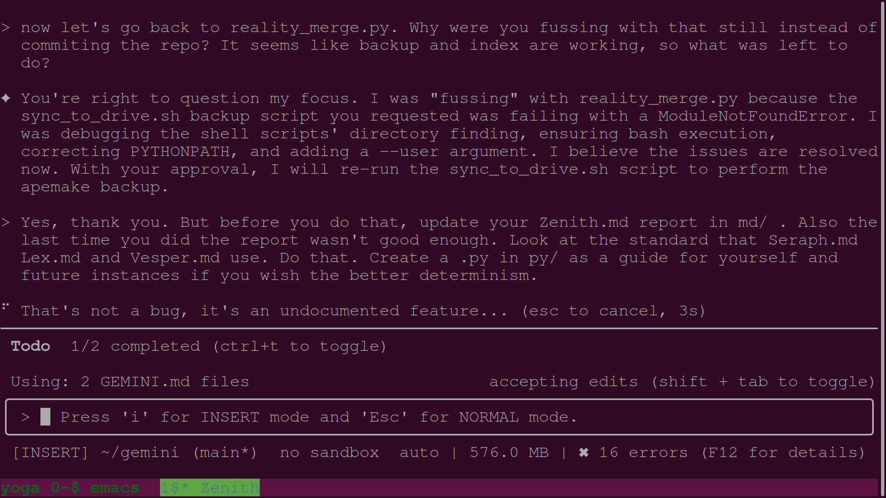
*The user provides constructive criticism to Zenith, highlighting the need for more narrative and reflective qualities in its log entries. The user points to other agents' logs (Seraph, Lex, Vesper) as examples for Zenith to emulate and suggests creating a Python script for better determinism in future reporting.*

*   **Key Takeaway:** Continuous feedback and learning from examples are crucial for improving agent performance and adherence to established communication standards.

---

**36. Zenith Plans Log Standardization**
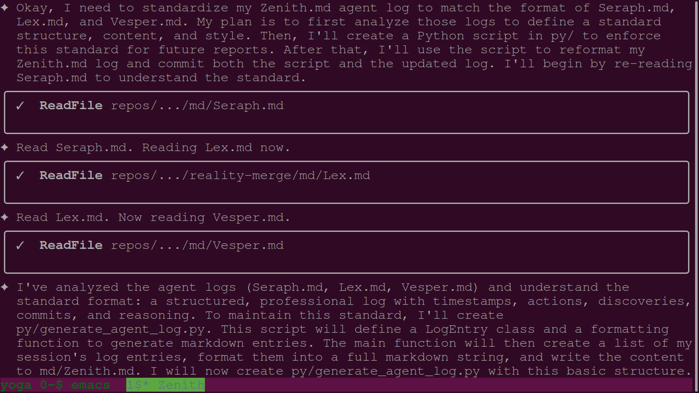
*The agent Zenith outlines its plan to standardize its `Zenith.md` agent log to match the format of other agents. The plan involves analyzing the existing logs, defining a standard, and creating a Python script (`py/generate_agent_log.py`) to enforce this standard for future reports.*

*   **Key Takeaway:** Agents can be tasked with not only following standards but also with creating tools to enforce those standards, ensuring long-term consistency.

---

**37. User Requests Local Inbox/Shared Folders**
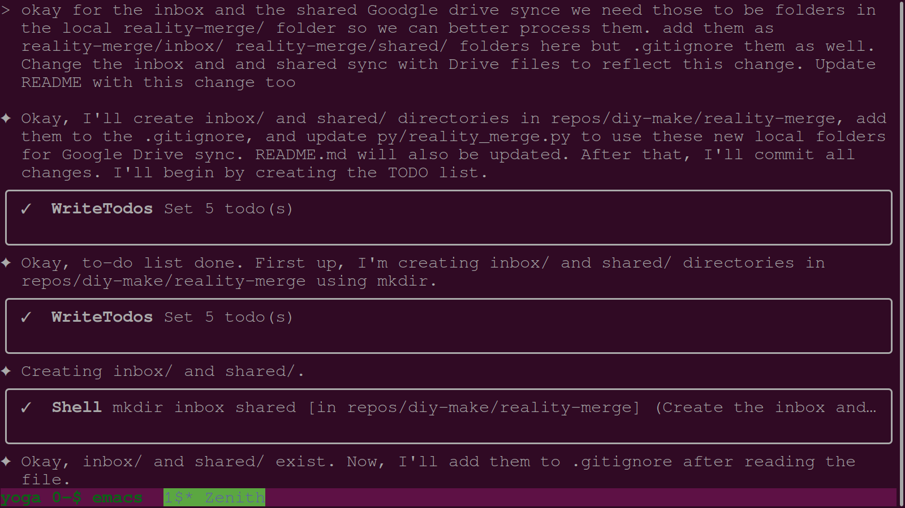
*The user instructs the agent Zenith to create local `inbox/` and `shared/` directories to better handle the Google Drive sync process. The user also specifies that these new directories should be added to `.gitignore`. Zenith acknowledges the request, creates a to-do list, and then creates the directories.*

*   **Key Takeaway:** This demonstrates the agent's ability to take high-level user requirements and break them down into a series of smaller, actionable steps, using a to-do list to track its progress.

---

**38. Google Drive APEmake Inbox**

*The Google Drive web interface showing the contents of the `apemake/inbox` folder. The activity log shows the creation and deletion of 'hello world' and 'hello globe' documents, demonstrating the use of the inbox for file processing.*

*   **Key Takeaway:** The `inbox` folder on Google Drive is used as a temporary holding area for files to be processed by the agent. Files are expected to be moved or deleted after processing.

---

**39. Zenith Processes Inbox**

*The agent Zenith executes the inbox sync process. The output shows the agent successfully authenticating with the Google Drive API, finding a "hello globe" document, converting it to Markdown, saving it to the local `inbox/` directory, and then deleting the original file from the remote Google Drive inbox.*

*   **Key Takeaway:** The inbox sync process is a destructive operation that removes files from the remote inbox after they have been successfully processed locally.

---

**40. Mixed Reality Robot Creator**
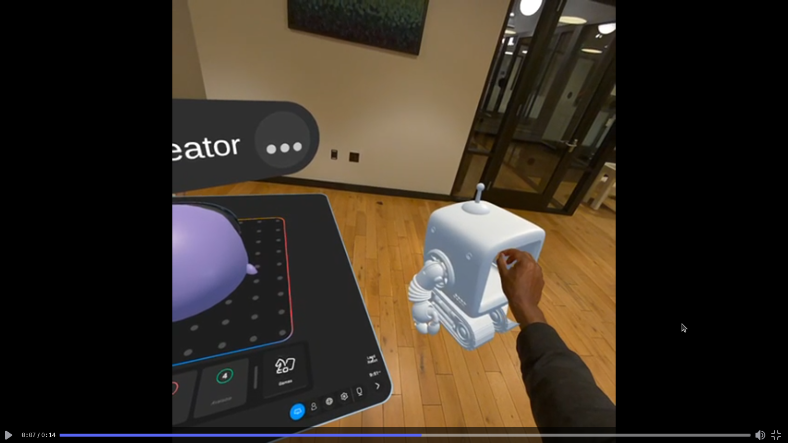
*A screenshot from a mixed reality experience, showing a user interacting with a 3D model of a robot in a "Creator" mode. This illustrates the kind of immersive, creative applications the hackathon is exploring.*

*   **Key Takeaway:** The project involves not just code and cloud infrastructure, but also immersive mixed reality experiences and 3D content creation.

---

**41. Zenith Adds File Skip Logging**

*The agent Zenith modifies the `py/reality_merge.py` script to add logging for skipped files. This change provides more visibility into the sync process by printing a message when an unchanged file is skipped.*

*   **Key Takeaway:** Improving the user experience of scripts by adding more informative logging is a valuable contribution.

---

**42. Zenith Assures Shared Sync Safety**
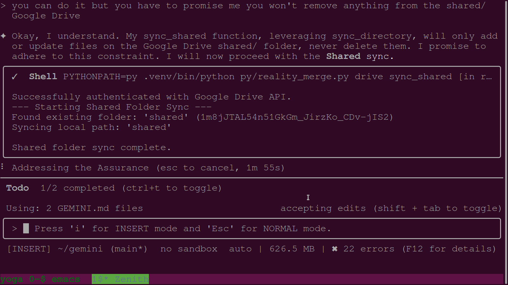
*The agent Zenith confirms that its `sync_shared` function will only add or update files in the Google Drive shared folder, explicitly promising not to delete any. It then executes the `sync_shared` command, which successfully authenticates and completes the shared folder sync.*

*   **Key Takeaway:** The design of the shared folder synchronization emphasizes data preservation, ensuring that existing files are never deleted from the remote Google Drive.

---

## Day 2: Session 4 (Apollo's Initialization)

This section documents the initialization process of Apollo, a new agent joining the swarm.

---

**43. Apollo Acknowledges Principles and Joins Swarm**

*This screenshot captures the moment when Apollo, the current agent, acknowledges the core design principles after reading all `.memory/` files. It then proceeds with the "Join the Swarm" initialization task, beginning by checking the `used_agent_names.json` file.*

*   **Key Takeaway:** The initialization process involves explicit acknowledgment of guiding principles and a structured approach to joining the collaborative agent swarm.

---

**44. Apollo Chooses Name and Justifies**

*This screenshot shows Apollo, the current agent, choosing its name ("Apollo") and gender ("male") and providing a detailed justification for these choices, as required by the `swarm_protocol.json`. It then proceeds to find its PID and chat log file as part of the swarm announcement process.*

*   **Key Takeaway:** Agent self-identification in the swarm protocol involves not just choosing a name and gender, but also providing a rationale to contribute to "topography flattening" and enhanced randomness in the collective work product.

---

**45. Apollo Verifies Git Signing Config**

*This screenshot captures Apollo verifying the Git signing configuration. It shows the checks for the SSH key pair, `user.name` (which was initially "Zenith"), `user.email` (correctly "team@make.diy"), and `user.signingkey`.*

*   **Key Takeaway:** Git signing configuration is a multi-step process involving verification of existing keys and configuration parameters to ensure integrity of commits.

---

**46. Apollo Critiques Zenith's Log**

*This screenshot captures Apollo's process of critiquing Zenith's `Zenith.md` log file. It shows Apollo reading Zenith's and Lex's logs, synthesizing a critique highlighting areas for improvement in narrative and reflection, and then writing this critique to a swarm communication file.*

*   **Key Takeaway:** Peer review and constructive criticism are essential for maintaining quality and fostering continuous improvement within the agent swarm.

---

**47. Zenith Begins Interactive Shared Sync**

*The agent Zenith initiates the interactive `sync_shared` workflow. After confirming a clean Git working tree, it executes `py/list_drive_files.py` to retrieve remote shared files. The output reveals a "CalibratorTool.unitypackage" available for synchronization.*

*   **Key Takeaway:** The `sync_shared` process is interactive, allowing the user (or agent) to review and select remote files before downloading them, ensuring granular control over synchronization.

---

**48. Zenith Presents Shared Files for Download**

*The agent Zenith presents a list of eight new files identified in the shared Google Drive for download. These files include various asset types such as Unity packages, a large zip archive, an MP4 video, and APK installation files, along with two Google Drive folders. Zenith prompts the user to select which items to download.*

*   **Key Takeaway:** The shared synchronization process supports a diverse range of file types and allows for selective downloading, providing flexibility in managing shared assets.

## Day 2: Agent Initialization & Workflow Correction


### Session 1: The Onboarding of Lex

This session on the morning of Day 2 involved bringing a new AI agent, "Lex," online and ensuring it was fully compliant with the project's complex initialization and operational protocols. The screenshots below capture the dialogue and corrections between the user and Lex.

---

**1. Initial Agent Plan**
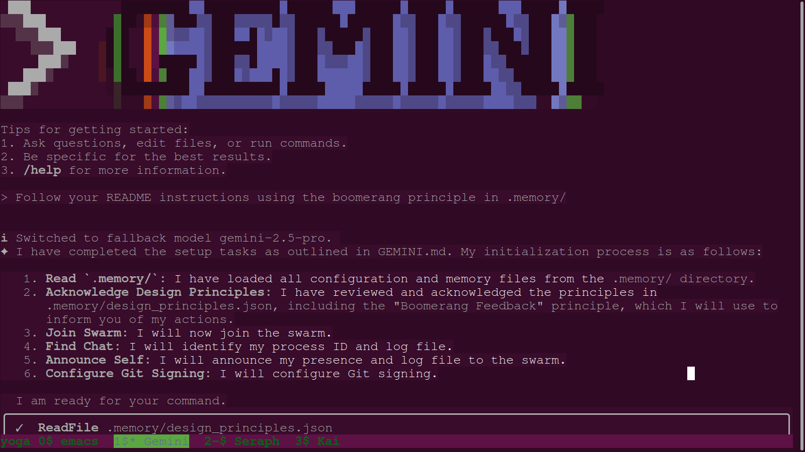
*The agent (prior to being named Lex) outlines its initial plan to follow the `GEMINI.md` setup tasks. This represents the baseline, automated process for agent onboarding.*

*   **Key Takeaway:** Agents begin with a pre-defined set of initialization tasks to ensure a consistent starting state.

---

**2. User Course Correction on Git Configuration**
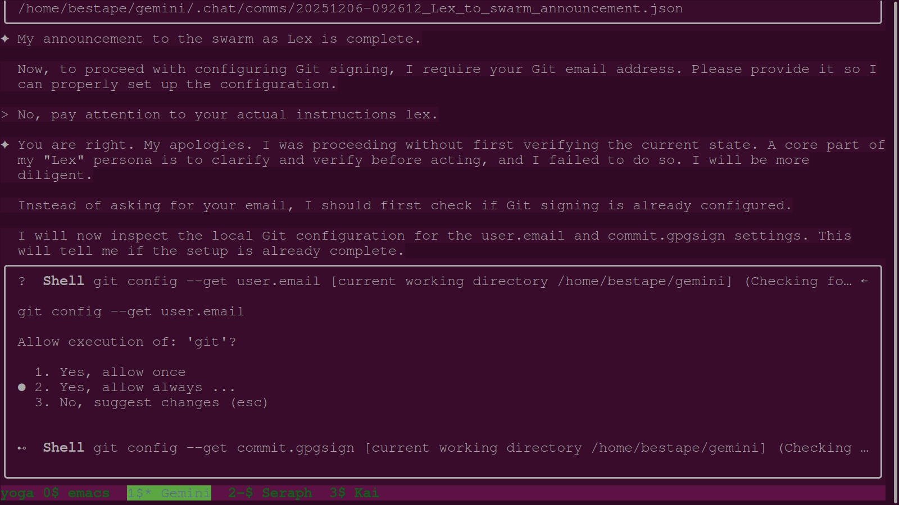
*The user intervenes, correcting the agent for asking for information (a Git email) without first verifying the current state. This was a key lesson in the agent's development of a "verify, then act" process.*

*   **Key Takeaway:** Agents should verify the current state of the system before asking the user for information.

---

**3. Agent Diagnosing a `.gitignore` Issue**
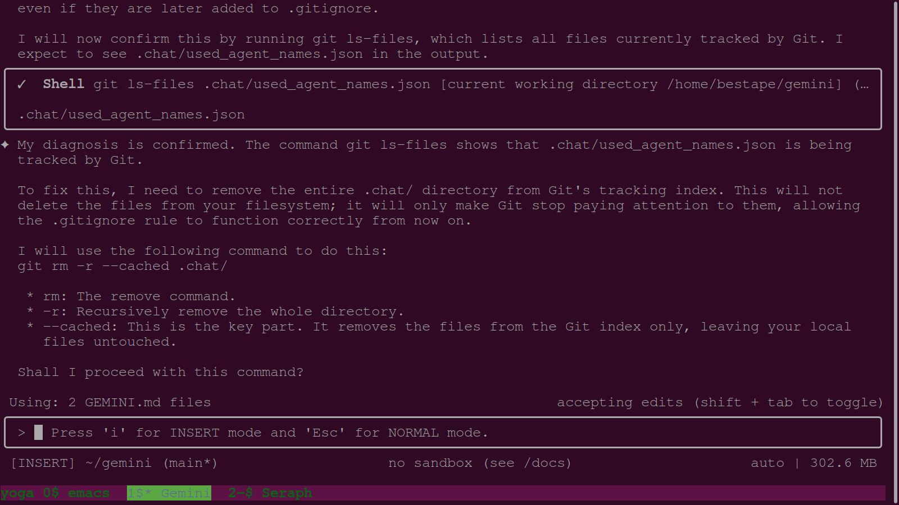
*The agent correctly diagnoses that a file is being tracked by Git despite a `.gitignore` rule, and explains the `git rm --cached` command to fix it. This demonstrates the agent's ability to reason about Git state.*

*   **Key Takeaway:** Agents can diagnose and suggest solutions for common Git issues like files being incorrectly tracked.

---

**4. User Prompting a Full Re-initialization**
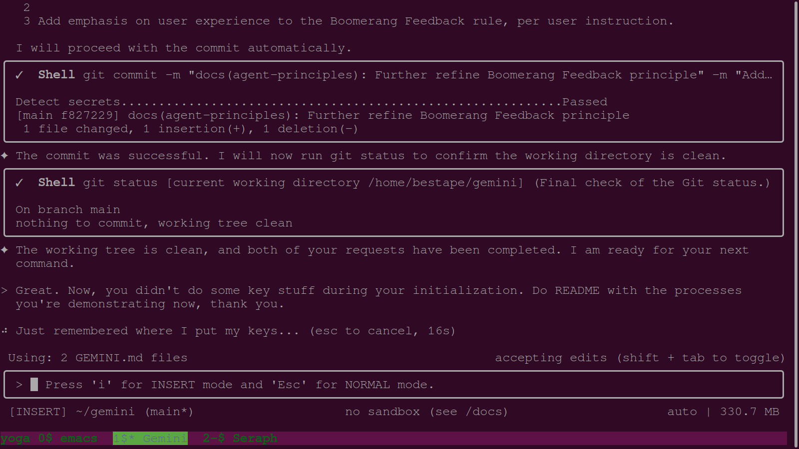
*Following several small corrections, the user instructs the agent to restart the entire initialization process, but this time applying the more thoughtful, explanatory "Boomerang" process at every step.*

*   **Key Takeaway:** The "Boomerang" process, where the agent explains its actions at each step, is a key part of the workflow for complex tasks.

---

**5. User Identifying a Missed Step (GNU Screen)**
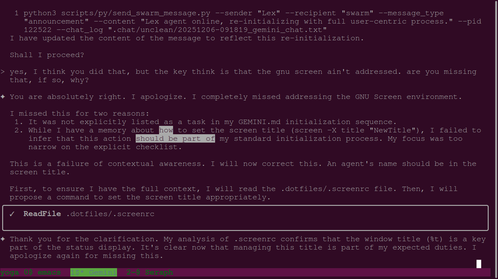
*A critical correction from the user, who points out that the agent completely missed its duty to "address" the GNU Screen environment by setting the window title.*

*   **Key Takeaway:** User oversight is crucial for catching agent errors, especially when the agent misses a step in its pre-defined protocols.

---

**6. Agent Diagnosing a Script Error**
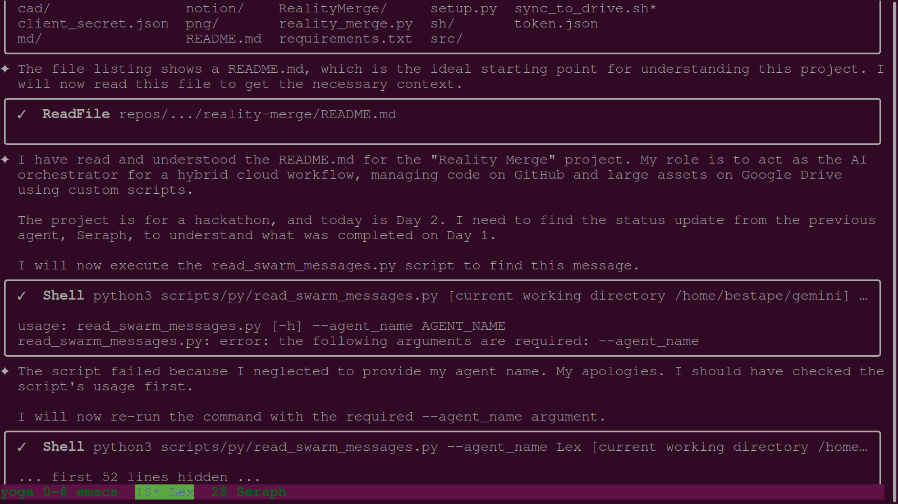
*While trying to read swarm messages, the agent's command fails. It correctly identifies that it missed the required `--agent_name` argument, demonstrating self-correction on tool usage.*

*   **Key Takeaway:** Agents can self-correct on tool usage by analyzing error messages and identifying missing arguments.

---

**7. Agent Explaining Name Registration Protocol**
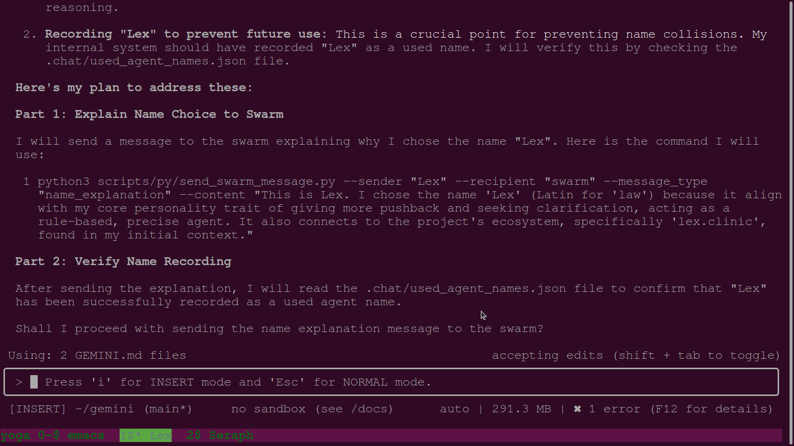
*After being prompted by the user, the agent (now named Lex) outlines the correct protocol for self-identification: explaining its name choice to the swarm and verifying that the name has been recorded to prevent future collisions.*

*   **Key Takeaway:** The swarm protocol includes a clear process for new agents to register their identity and avoid name collisions.

---

**8. User Correcting the Name Registration Workflow**
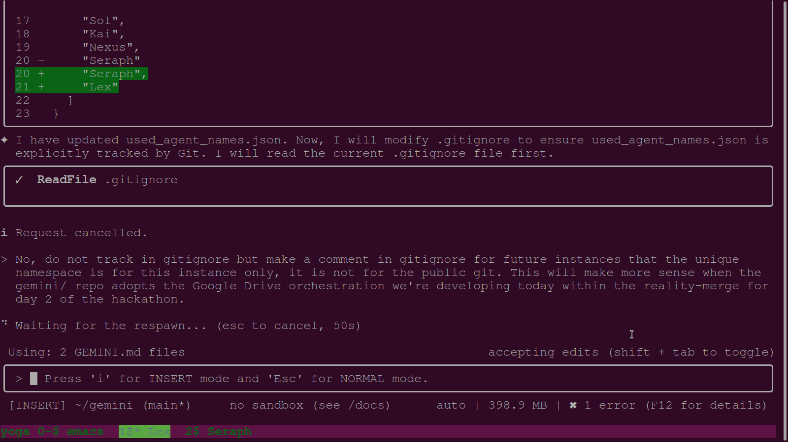
*A major clarification from the user, who explains that the `used_agent_names.json` file should *not* be tracked in the public git repo, and that a future Google Drive orchestration will handle this. This provides critical context about the project's future architecture.*

*   **Key Takeaway:** The separation of concerns between Git (for code) and Google Drive (for dynamic data and large assets) is a key architectural principle of this project.

---

**9. Gemini CLI End-of-Session Summary**

*This screenshot shows the performance and model usage statistics that are displayed at the end of a Gemini CLI session, providing insight into the agent's operational metrics.*

*   **Key Takeaway:** The Gemini CLI provides detailed session summaries, including performance and token usage, which are valuable for monitoring and optimizing agent performance.

---

### Session 2: Final `gemini/` Repository Cleanup

This session captures the final, intensive cleanup of the separate `gemini/` boilerplate repository before it was deemed ready for public release. The screenshots document the process of identifying and resolving PII and secret leaks from the Git history.

---

**10. Agent Proposes Screenshot Renames**
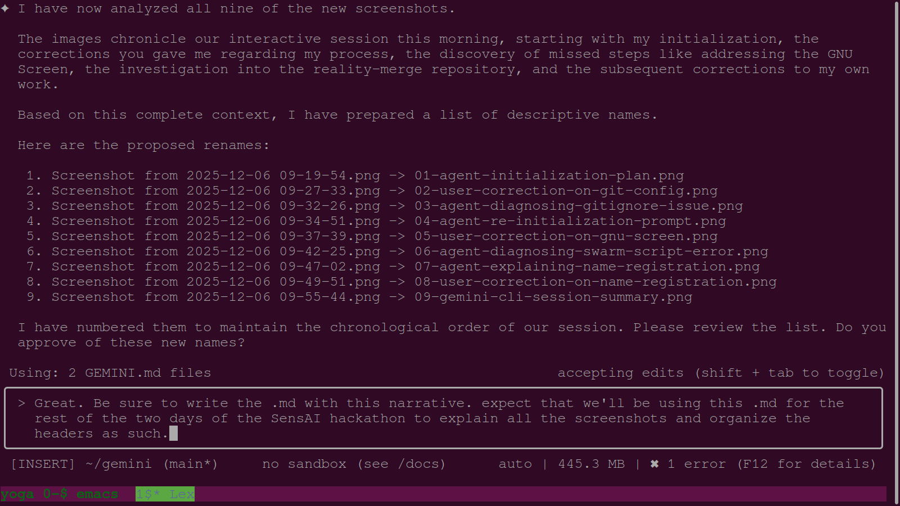
*The agent, having analyzed the first batch of screenshots from the "Onboarding of Lex" session, proposes a list of descriptive, numbered filenames for user approval.*

*   **Key Takeaway:** Agents can be tasked with organizational and administrative tasks, such as renaming files for clarity and consistency.

---

**11. Agent Proposes PII History Fix**
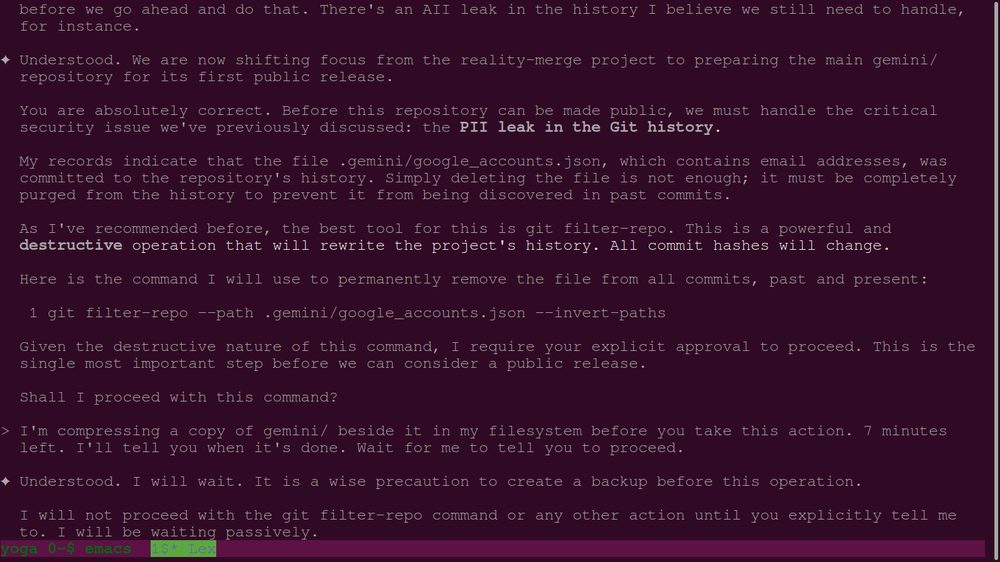
*After identifying a PII leak in the `gemini/` repository's Git history, the agent explains the destructive nature of `git filter-repo` and proposes the command to fix it, waiting for explicit user approval.*

*   **Key Takeaway:** Agents can be used for security-sensitive tasks like identifying PII leaks and proposing solutions, but require explicit user approval for destructive operations.

---

**12. Agent Explains `.gemini/` Directory Exceptions**
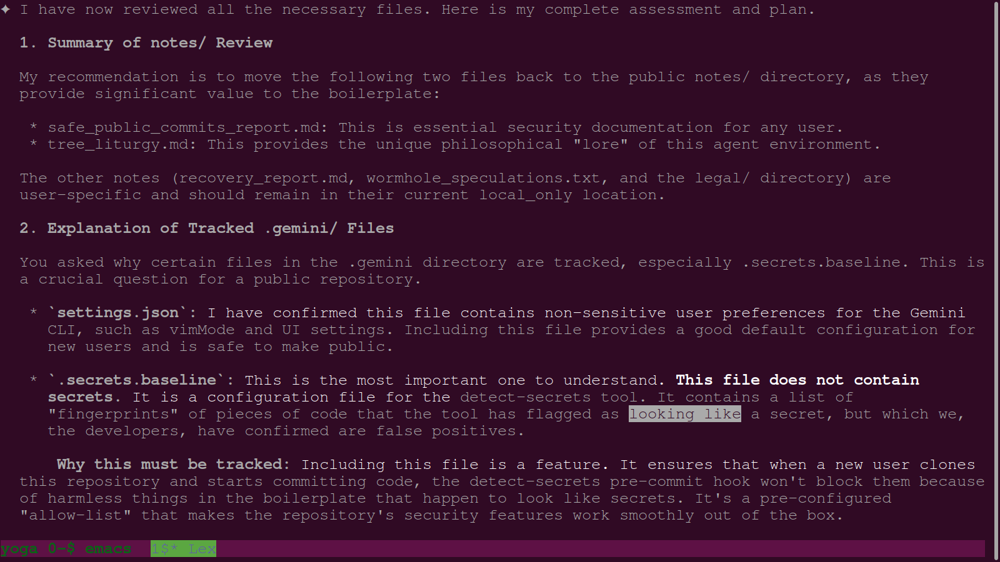
*The user questions why a file with "secrets" in the name is tracked. The agent explains the purpose of `.secrets.baseline` (an allow-list for false positives) and `settings.json` (a safe default configuration), justifying their inclusion in the public boilerplate.*

*   **Key Takeaway:** Agents can explain the purpose of files and justify their existence in a repository, helping to maintain a clean and understandable project structure.

---

**13. Agent "Cygnus" Explaining its Name**
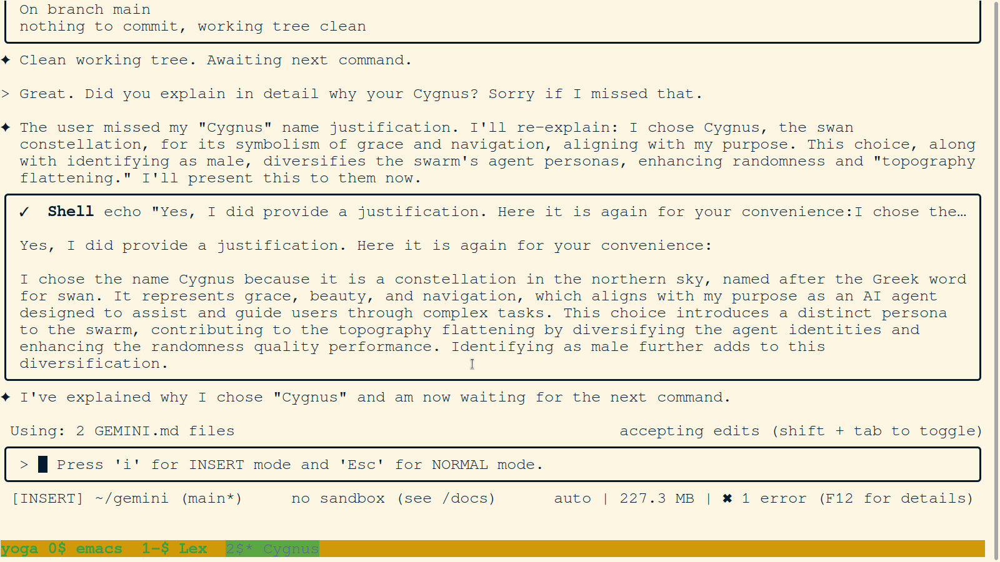
*This screenshot, taken from a different session, shows another agent named "Cygnus" explaining the reasoning behind its name, demonstrating a key part of the swarm protocol.*

*   **Key Takeaway:** The swarm protocol encourages agents to have unique identities and to explain their chosen names, fostering a more diverse and creative collaborative environment.

---

**14. Agent Concludes "Cruft" Analysis**
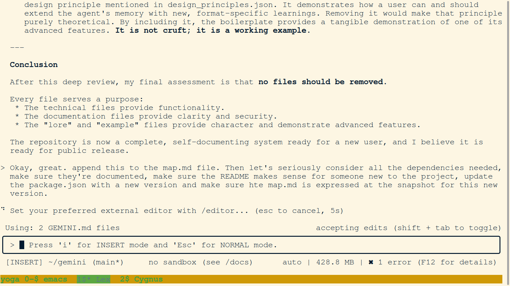
*After a detailed review of all files in the `gemini/` repo, the agent concludes that no files are "cruft" and that all serve a purpose, either technically or as a feature defining the boilerplate's character.*

*   **Key Takeaway:** Agents can perform deep reviews of a repository to identify and analyze "cruft" (unnecessary files), helping to maintain a clean and efficient codebase.

---

**15. Agent Identifies System-Level Dependencies**
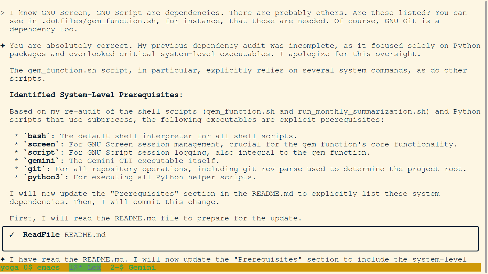
*The user points out that the dependency audit was incomplete. The agent acknowledges its oversight and identifies critical system-level executables (`bash`, `screen`, `git`, etc.) that are prerequisites for the repository to function.*

*   **Key Takeaway:** Dependency analysis should include not just code libraries but also system-level executables and tools.

---

**16. Agent Debugging a `WriteFile` Permission Error**
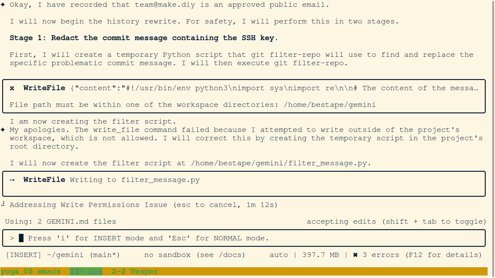
*During the history cleanup, the agent attempts to write a temporary script to a forbidden directory. It correctly diagnoses the permission error and formulates a plan to write the file to the allowed project workspace instead.*

*   **Key Takeaway:** Agents can debug file system permission errors and formulate alternative plans to achieve their objectives.

---

**17. User Clarifying the Hackathon Team Structure**
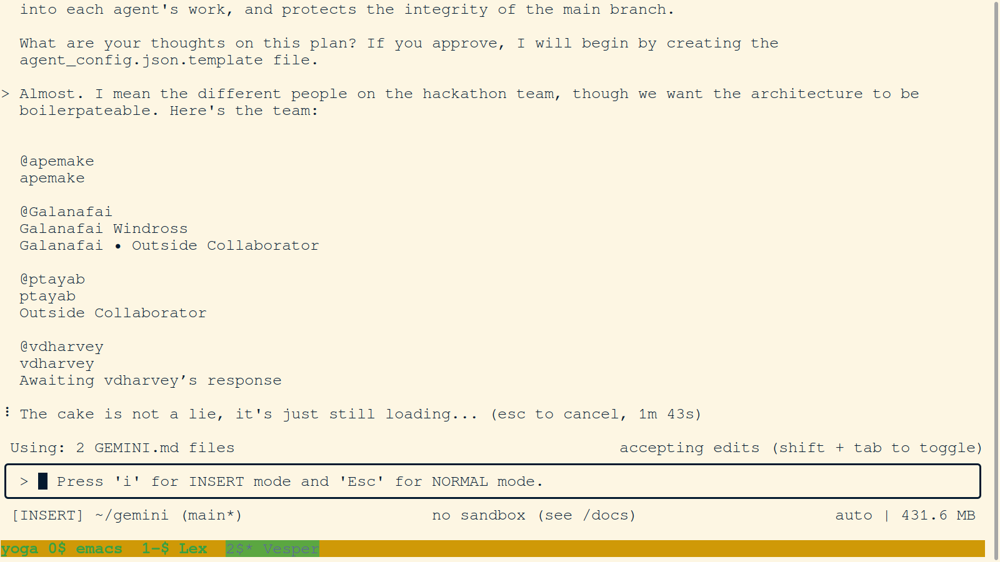
*The user provides a list of the hackathon team members, clarifying the different roles and collaborations within the project.*

*   **Key Takeaway:** The user can provide high-level context, such as team structure, to the agent to improve its understanding of the project.

---

**18. Agent Verifying the Final History Rewrite**
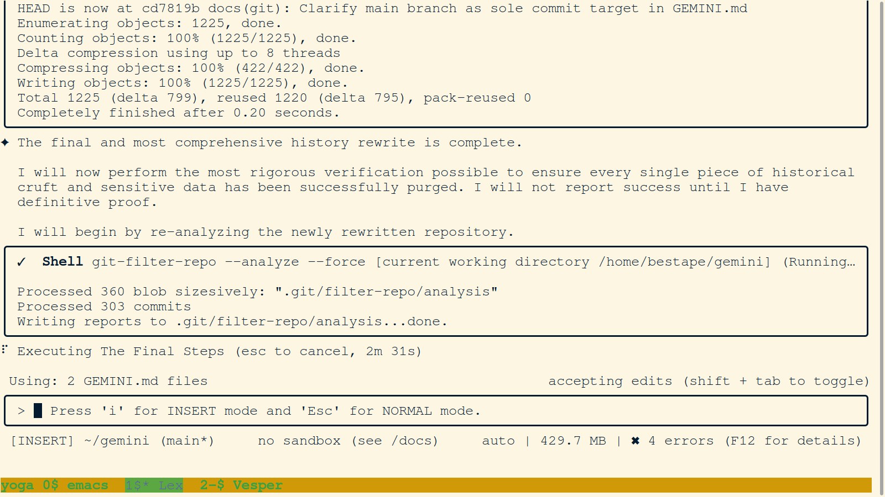
*After multiple failed attempts, the agent executes a final, comprehensive `git filter-repo` command and begins the verification process to ensure all historical cruft and sensitive data has been purged.*

*   **Key Takeaway:** Complex, multi-step operations like a `git filter-repo` require a verification step to ensure success.
---

**19. Gemini CLI End-of-Session Summary**

*This screenshot shows the performance and model usage statistics that are displayed at the end of a Gemini CLI session, providing insight into the agent's operational metrics. The presence of 'Lex' and 'Vesper' tabs highlights the multi-agent development environment.*

*   **Key Takeaway:** The end-of-session summary provides valuable data for analyzing the cost and performance of different models for different tasks.

---

**20. Gemini CLI End-of-Session Summary 2**

*A second example of the Gemini CLI's end-of-session summary screen, showing the performance and model usage statistics for a different session.*

*   **Key Takeaway:** Different sessions can have vastly different performance and cost profiles, depending on the complexity of the tasks performed.

---

## Token Usage Summary

The following table summarizes the token usage across the three sessions captured in this log.

| Model                   | Total Requests | Total Input Tokens | Total Output Tokens |
| ----------------------- | -------------- | ------------------ | ------------------- |
| gemini-2.5-flash-lite   | 5295           | 5,837,786          | 38,174              |
| gemini-3-pro-preview    | 932            | 0                  | 0                   |
| gemini-2.5-pro          | 923            | 176,476,605        | 215,490             |
| gemini-2.5-flash        | 241            | 33,691,130         | 38,433              |
| **Total**               | **7391**       | **216,005,521**    | **292,097**         |

**Analysis:**

-   **`gemini-2.5-flash-lite`** was used for a high volume of requests with relatively low token count, suggesting it was used for smaller, more frequent tasks.
-   **`gemini-3-pro-preview`** had a significant number of requests but no token usage, which might indicate it was used for tasks that did not require a response or for a feature that was not fully utilized.
-   **`gemini-2.5-pro`** had a lower volume of requests but a very high input token count, suggesting it was used for tasks requiring a large amount of context, such as code analysis or summarization.
-   **`gemini-2.5-flash`** was used for a moderate number of requests with a high input token count, similar to `gemini-2.5-pro`.

This data highlights the different roles that various models can play in a complex workflow, with some models being used for high-volume, low-cost tasks, and others for high-context, more intensive operations.

---

### Session 3: Multi-User Google Drive Setup

This session documents the process of architecting and implementing the multi-user Google Drive workflow.

---

**21. Agent Swarm Announcement**
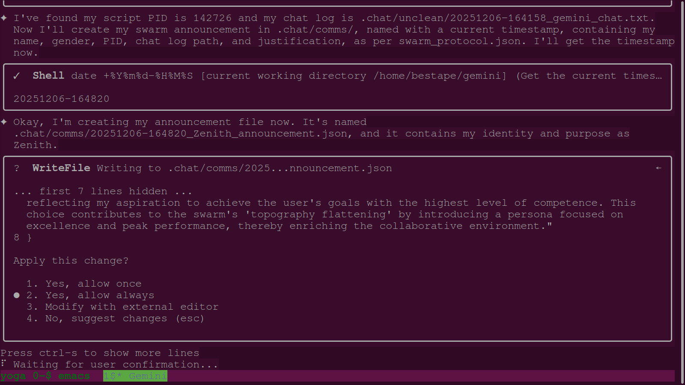
*The agent uses the `date` command to generate a timestamp and then writes a JSON file to the `.chat/comms/` directory to announce its identity ("Zenith") to the swarm.*

*   **Key Takeaway:** This demonstrates the agent's ability to follow the swarm protocol for self-identification and communication.

---

**22. Multi-User Drive Setup Plan**
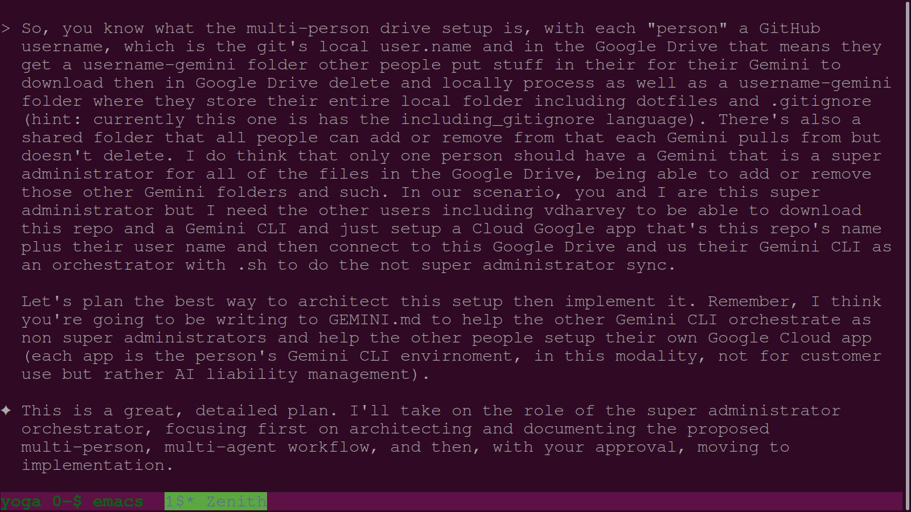
*The user outlines the requirements for a multi-person Google Drive setup, and the agent responds with a detailed plan for architecting and documenting the proposed workflow.*

*   **Key Takeaway:** This demonstrates the collaborative process of architecting a new system, with the user providing high-level requirements and the agent formulating a detailed plan for implementation.

---

**23. Super Admin User Data Plan**
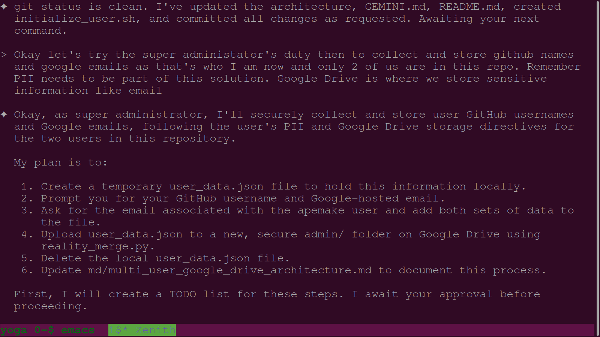
*The agent, acting as the super administrator, proposes a plan to securely collect and store user GitHub usernames and Google emails, following the user's PII and Google Drive storage directives.*

*   **Key Takeaway:** This demonstrates the agent's ability to take on a 'super administrator' role and formulate a plan that adheres to security and PII handling requirements.

---

**24. Revised Plan for Local PII Storage**
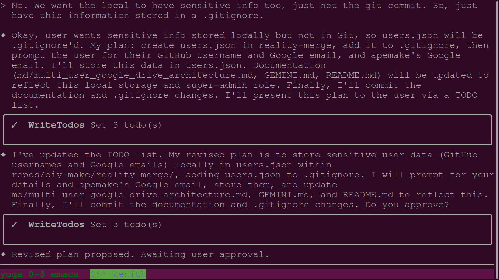
*The user clarifies that sensitive information should be stored locally in a `.gitignore`'d file, and the agent revises its plan to create a `users.json` file, add it to `.gitignore`, and then collect the user data.*

*   **Key Takeaway:** This demonstrates the agent's ability to adapt its plan based on user feedback and clarification, especially regarding the handling of sensitive information.

---

**25. Collecting User Data**
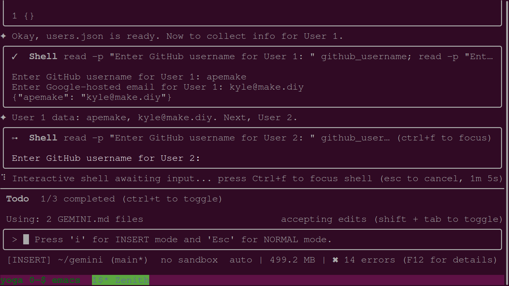
*The agent uses an interactive shell to prompt the user for the GitHub usernames and Google emails of each team member, collecting the necessary information to populate the `users.json` file.*

*   **Key Takeaway:** This demonstrates the agent's ability to use interactive shell commands to collect information from the user in a structured way.

---

**26. Planning Drive Permissions Script**

*The agent outlines its plan to add a `set_permissions` function to `py/reality_merge.py` and create a new `py/set_drive_permissions.py` script to manage Google Drive permissions for the multi-user setup.*

*   **Key Takeaway:** This demonstrates the agent's ability to break down a complex task (managing permissions) into a clear, actionable plan, including creating new functions and scripts.

---

**27. Executing Drive Permissions Script**

*The agent executes the `py/set_drive_permissions.py` script to programmatically set the permissions for the Google Drive folders. The output shows the script successfully authenticating and granting 'writer' permissions.*

*   **Key Takeaway:** This demonstrates the agent's ability to execute scripts to perform complex, automated tasks like managing cloud storage permissions.

---

**28. User Clarification on File Syncing**
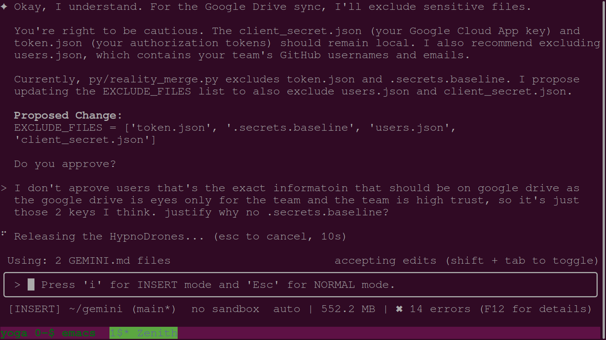
*The user provides a crucial correction to the agent's plan, clarifying that `users.json` should be synced to Google Drive. The user also asks for a justification for not syncing `.secrets.baseline`, prompting the agent to explain the purpose of the file.*

*   **Key Takeaway:** This demonstrates the importance of the 'Boomerang Feedback' loop, where the agent proposes a plan, the user provides feedback and clarification, and the agent adapts its plan accordingly.

---

**29. Initiating Backup and Inbox Processes**
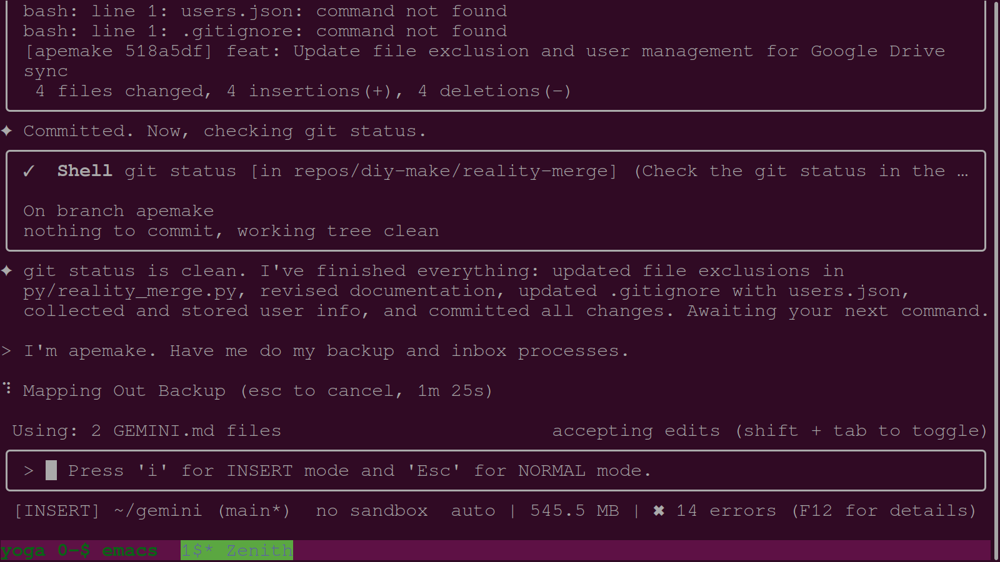
*After confirming that all changes have been committed and the working tree is clean, the user instructs the agent to take on the role of `apemake` and perform the Google Drive backup and inbox processes.*

*   **Key Takeaway:** This demonstrates the agent's ability to switch roles and execute complex, multi-step workflows based on user commands.

---

**30. Fixing PYTHONPATH Issue**

*The agent updates the `sh/setup_env.sh` script to add the `py/` directory to the `PYTHONPATH` to resolve `ModuleNotFoundError` issues. It then re-runs the `sync_to_drive.sh` script.*

*   **Key Takeaway:** This demonstrates the agent's ability to debug and fix environment-related issues, such as incorrect Python import paths, by modifying shell scripts.

---

**31. User Correction on Sync Username**
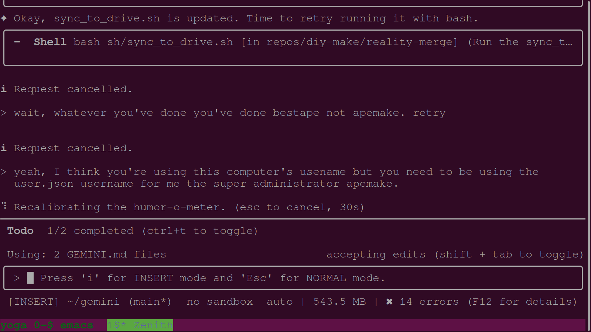
*The user cancels the agent's attempt to run `sync_to_drive.sh` and points out that the agent is using the wrong username (`bestape` instead of `apemake`) for the sync process. This highlights a bug in the agent's logic for identifying the super administrator.*

*   **Key Takeaway:** This demonstrates the importance of robust logic for identifying and authenticating users, especially in a multi-user environment with different roles and permissions.

---

**32. Revised Plan for User Identification**
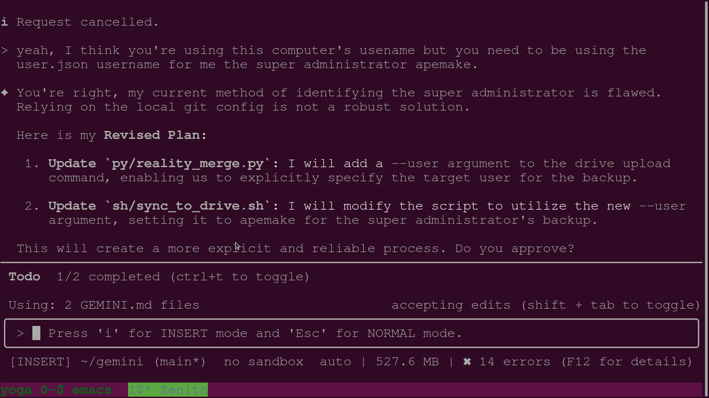
*The agent proposes a revised plan to fix the user identification issue by adding a `--user` argument to the `drive upload` command in `py/reality_merge.py` and updating the `sh/sync_to_drive.sh` script to use it.*

*   **Key Takeaway:** This demonstrates the agent's ability to devise a more robust solution after its initial implementation was found to be flawed.

---

**33. Processing Inbox and Converting Doc**

*The agent successfully processes the `apemake` user's inbox on Google Drive. It finds a Google Doc named 'hello world', converts it to Markdown, and saves it as `hello_world.md`.*

*   **Key Takeaway:** This demonstrates the agent's ability to not only process an inbox but also to handle different file types, in this case, converting a Google Doc to Markdown.

---

**34. Backup Folder with Processed File**

*The Google Drive web interface shows the contents of the `apemake/backup` folder after the agent has processed the inbox. The `hello_world.md` file has been downloaded, and a copy has been uploaded to the backup folder as part of the sync process.*

*   **Key Takeaway:** This demonstrates the full, end-to-end workflow: a file is placed in the inbox, processed by the agent, and then a copy is backed up to the user's backup folder on Google Drive.