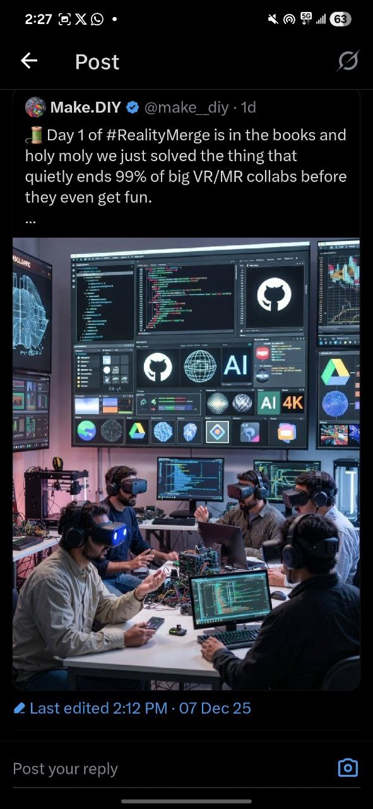
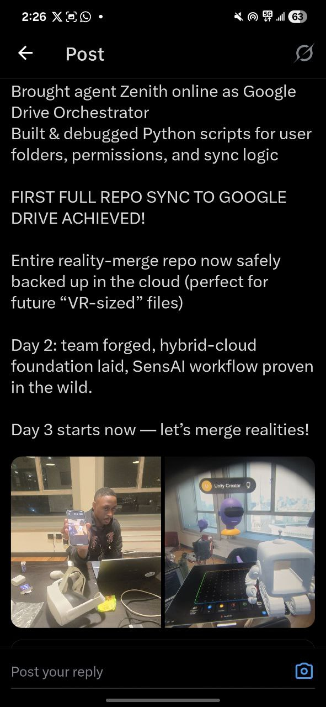

# Social Media Strategy: A Cosmolocal Approach

Our social media strategy for the Reality Merge hackathon is a "cosmolocal" one, designed to engage both our local hackathon community and a global network of makerspaces and supporters. Our goal is to share our journey, learnings, and the excitement of building the future of collaboration.

## The "gm!" Summaries

The core of our strategy is the daily "gm!" summary. Each day, the project's Super Administrator sends a brief summary of the previous day's progress to our key community supporters, such as **0ya 👻🌀** from the Honduran makerspace.

These summaries provide a high-level overview of our accomplishments, challenges, and key learnings. This creates a feedback loop that keeps our community engaged and informed.

## Community Amplification

Our community supporters then take these summaries and create social media posts to share with their networks. This allows us to:

*   **Reach a wider audience:** By leveraging the networks of our community supporters, we can reach a much larger and more diverse audience than we could on our own.
*   **Generate buzz:** The regular updates and social media engagement help to generate excitement and buzz around the project.
*   **Get feedback:** Social media provides a valuable channel for getting feedback and suggestions from the wider community.

## Examples from the Hackathon

Here are some examples of our social media strategy in action during the hackathon:

### Day 1 Recap

We started by sharing our progress on Day 1, highlighting the key problem we were solving.

### Day 2 Recap

Our Day 2 recap focused on the "SensAI Hack" and the successful integration of our hybrid cloud system.

### Community Engagement

Our community played a huge role in amplifying our message. Here's an example of 0ya sharing our Day 2 recap on the Make.DIY X account.

This led to more engagement and visibility for the project, as seen in the Make.DIY timeline.

This collaborative approach to social media has been instrumental in sharing our story and building a community around the Reality Merge project.