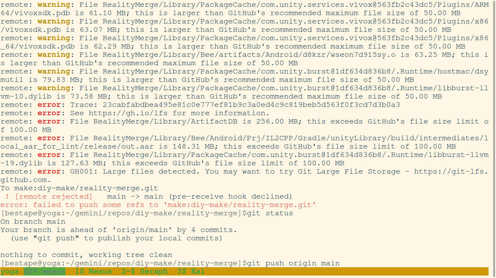
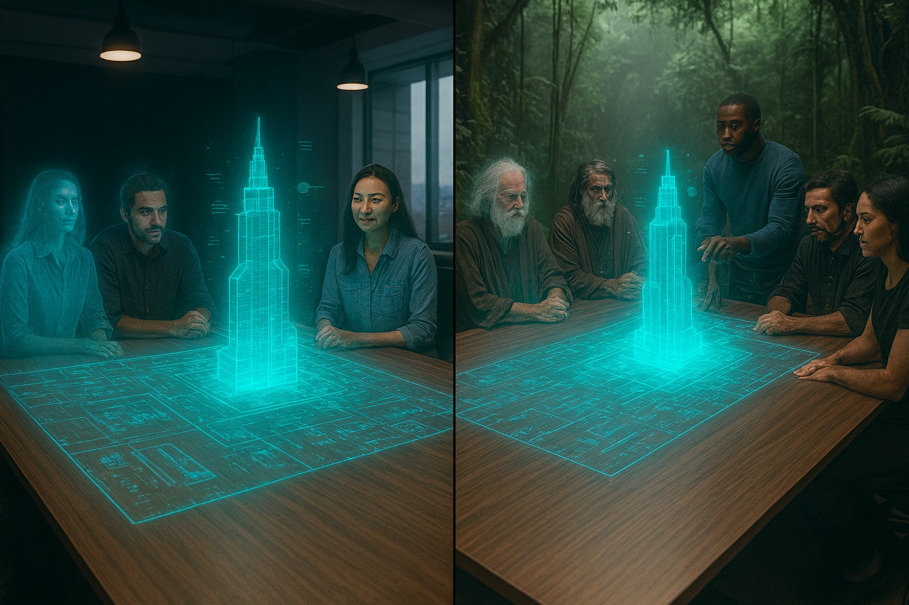
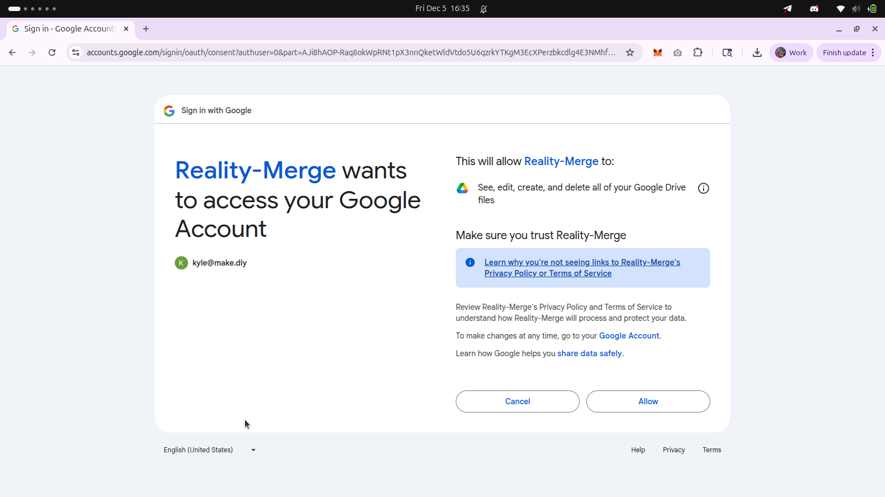
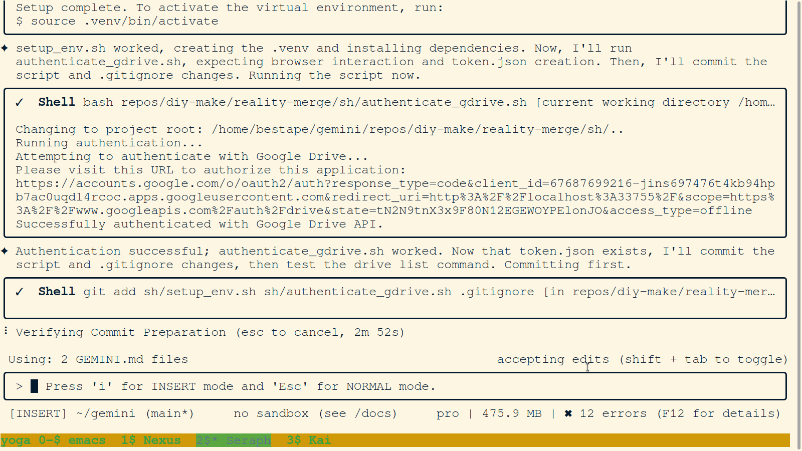
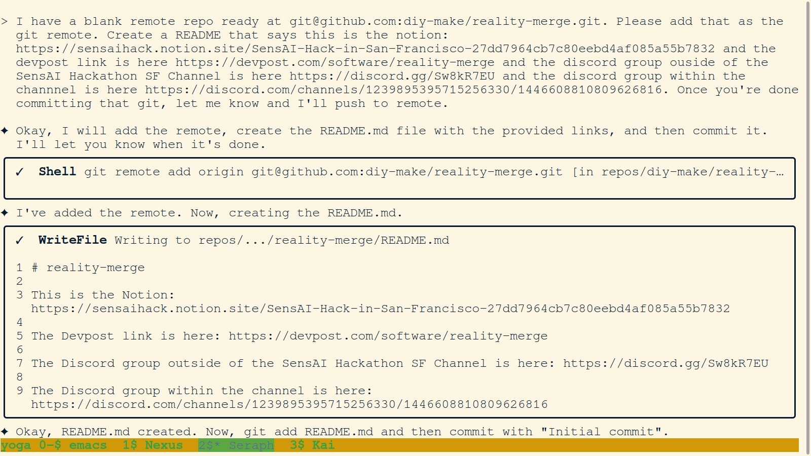
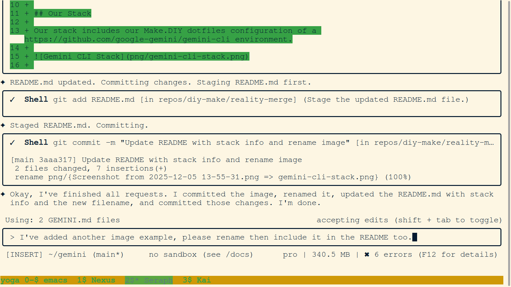
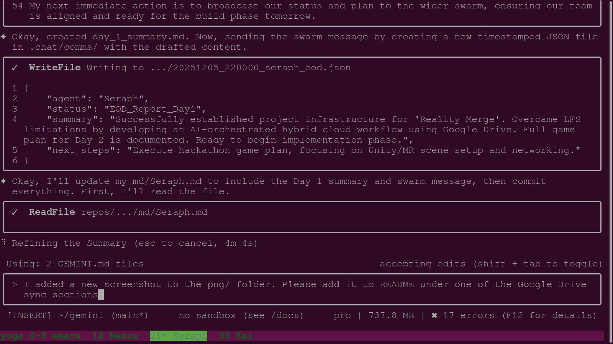
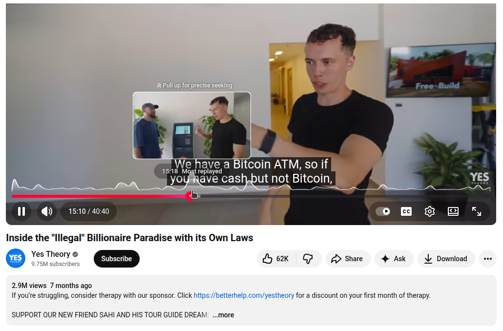
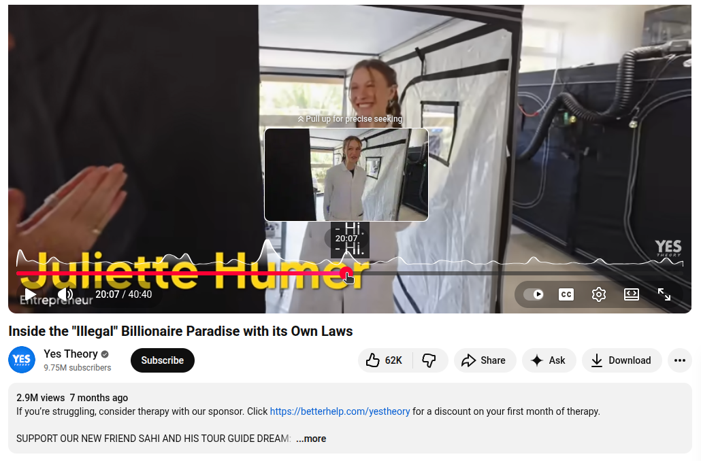

# Day 1 Snapshots

---

**1. GitHub Push Rejected due to File Size**

*This screenshot captures the moment the Git LFS experiment failed. The user's `git push` was rejected by the remote server because a file exceeded the size limit, even with LFS.*
*   **Key Takeaway:** Git LFS is not a silver bullet for large file management on all platforms. The hybrid cloud approach (Git + Google Drive) was validated by this failure.

---

**1a. Reality Merge Project Concept**

*This image visually represents the core concept and vision of the Reality Merge project.*
*   **Key Takeaway:** The project aims to create a shared, mixed-reality space for collaboration.

---

**2. Google Drive OAuth Consent Screen**

*This screenshot shows the Google Drive OAuth consent screen, where the user is prompted to authorize the `reality-merge` application to access their Google account.*
*   **Key Takeaway:** The application uses OAuth 2.0 for secure, user-authorized access to Google Drive.

---

**3. Google Drive Authentication Script Execution**

*This screenshot shows the successful execution of the `sh/authenticate_gdrive.sh` script. The script provides a URL for the user to complete the authentication flow and confirms that the authentication was successful.*
*   **Key Takeaway:** The authentication process is handled by a script that guides the user through the necessary steps.

---

**4. Google Drive CLI `list` Command Test**

*This screenshot shows a successful test of the `reality_merge.py drive list` command, which lists the files in a Google Drive folder. This confirms that the CLI tool can successfully communicate with the Google Drive API.*
*   **Key Takeaway:** The CLI tool provides a `list` command to inspect the contents of a Google Drive folder.

---

**5. Google Drive CLI `sync` Command in Action**

*This screenshot shows the `drive upload` command being used to sync the local project to Google Drive. This demonstrates the core functionality of the hybrid cloud solution.*
*   **Key Takeaway:** The CLI tool provides an `upload` command to sync local files to Google Drive.

---

**6. Google Drive Download Success**

*This screenshot shows a successful download of a file from Google Drive using the CLI tool. This demonstrates the other half of the sync functionality.*
*   **Key Takeaway:** The CLI tool can successfully download files from Google Drive.

---

**1c. Gemini CLI Stack**

*A visual representation of the Gemini CLI stack.*
*   **Key Takeaway:** The project leverages a custom Gemini CLI environment for its workflow.

---

**1d. Gemini CLI Workflow Example**

*An example of the workflow within the Gemini CLI.*
*   **Key Takeaway:** The workflow is designed for efficient AI-human collaboration.

---

**1e. Gemini Swarm Communication**

*An example of an AI agent (Seraph) sending a JSON-formatted status report to the agent swarm.*
*   **Key Takeaway:** The agents communicate through a structured swarm protocol.

---

**1f. YesTheory DUNA Makerspace Tour 1**

*A screenshot from the YesTheory video featuring the DUNA makerspace.*
*   **Key Takeaway:** The DUNA makerspace is a key inspiration for the project.

---

**1g. YesTheory DUNA Makerspace Tour 2**

*Another screenshot from the YesTheory video featuring the DUNA makerspace.*
*   **Key Takeaway:** The project draws inspiration from real-world collaborative spaces.