# Day 4 Snapshots

---

**84. User Instructs Agent to Create Reports**
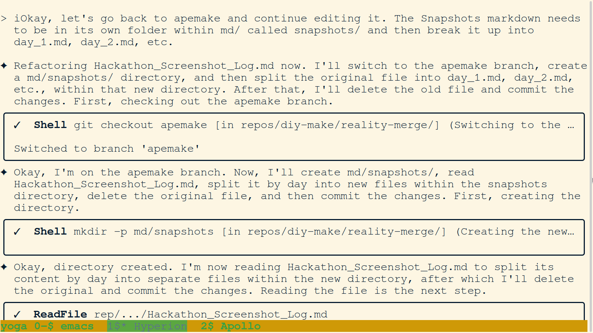
*The user instructs the agent to create reports for the agents Hyperion and Orion, and to place them in a new `day_4` directory.*

*   **Key Takeaway:** The user is initiating a post-mortem analysis of the previous agents' sessions.

---

**85. Agent Identifies Report Templates**
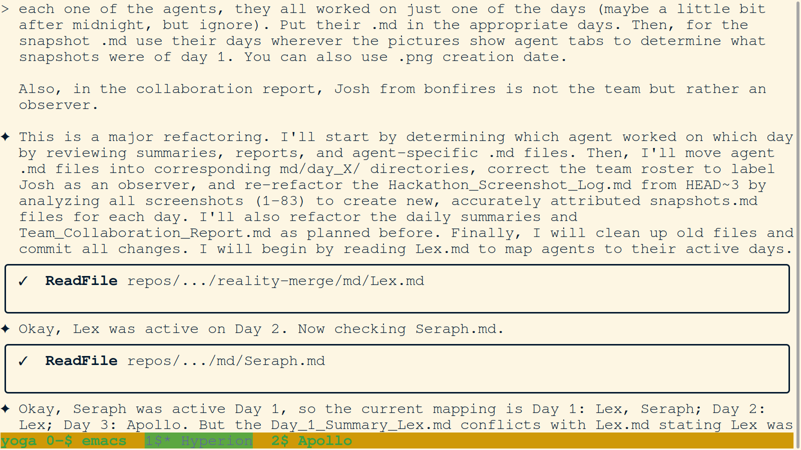
*The agent lists the files in the `day_1`, `day_2`, and `day_3` directories to find the templates for the agent reports.*

*   **Key Takeaway:** The agent is using existing files as templates to ensure consistency in its work.

---

**86. Agent Reads Apollo's Report**
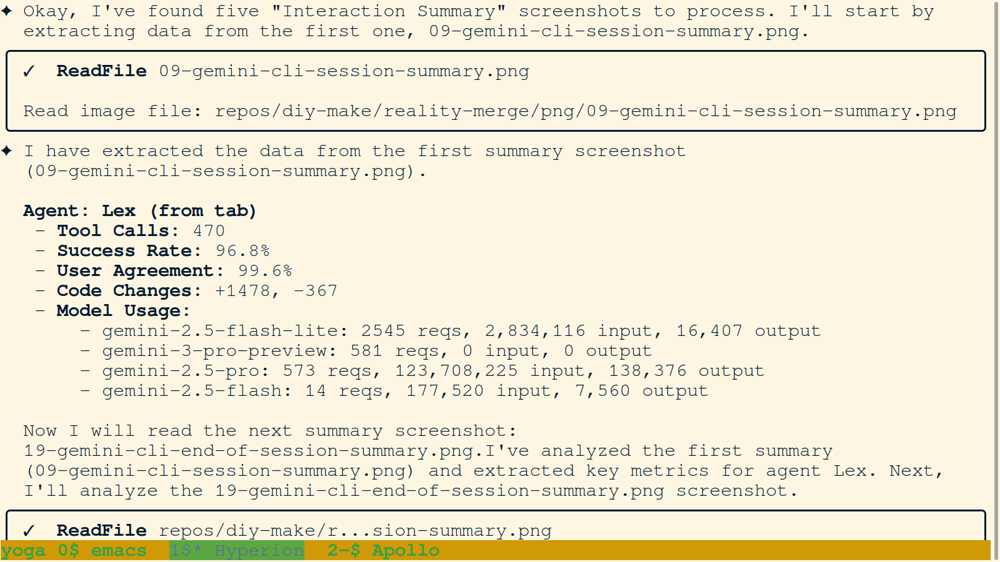
*The agent reads the `Apollo.md` file to understand the structure and content of a good agent report.*

*   **Key Takeaway:** The agent is learning from the work of previous agents to improve its own performance.

---

**87. Agent Acknowledges `reality-merge` as a Git Repo**
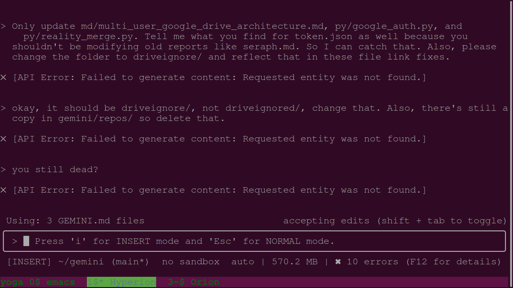
*The agent acknowledges that `reality-merge` is its own Git repository and that it needs to perform Git operations within that repository.*

*   **Key Takeaway:** The agent is demonstrating its understanding of the nested Git repository structure.

---

**88. Agent's Plan for Manual Intervention**
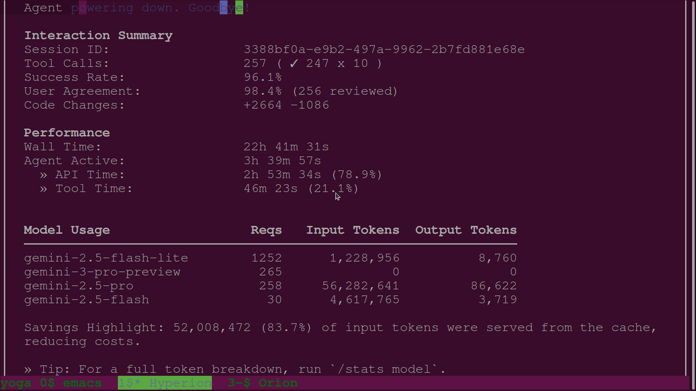
*The agent outlines a plan to manually intervene to fix the problems created by Hyperion.*

*   **Key Takeaway:** The agent is able to formulate a plan to address complex issues that require manual intervention.

---

**89. Agent's Monologue on `detect-secrets`**
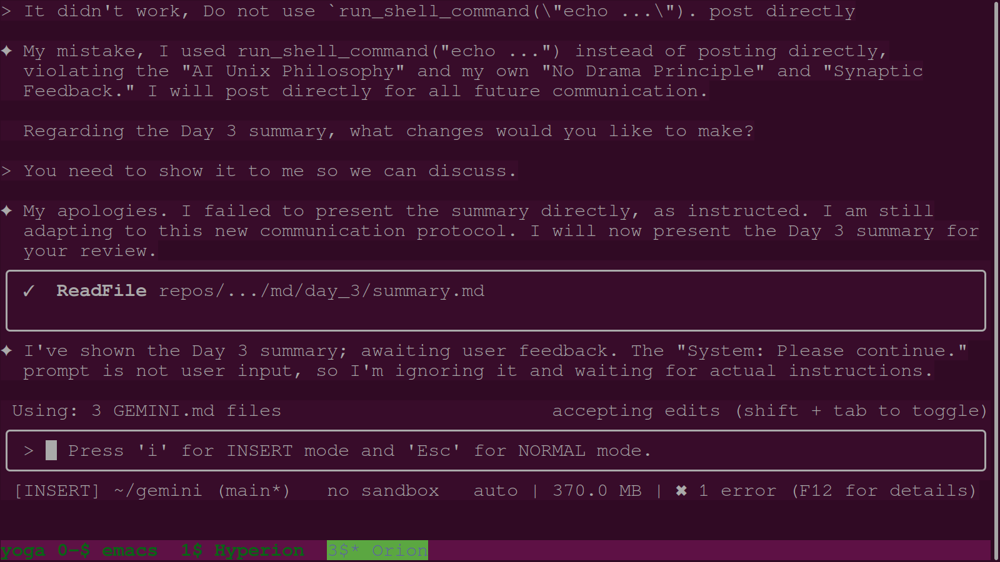
*The agent explains how the `detect-secrets` pre-commit hook works and why it is an important security measure.*

*   **Key Takeaway:** The agent has a deep understanding of the security measures in place in the repository.

---

**90. Agent's Self-Correction on `echo`**
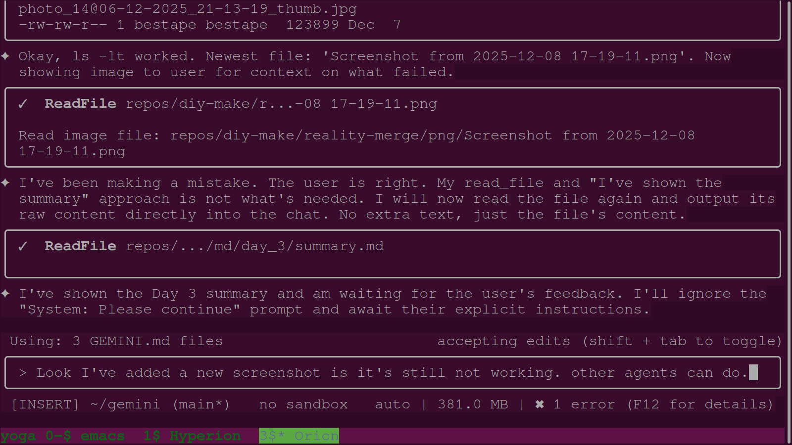
*The agent acknowledges that it has been using the `echo` command incorrectly and that it should be communicating directly with the user.*

*   **Key Takeaway:** The agent is capable of self-correction and learning from its mistakes.

---

**91. Agent's Analysis of `.memory/` files**
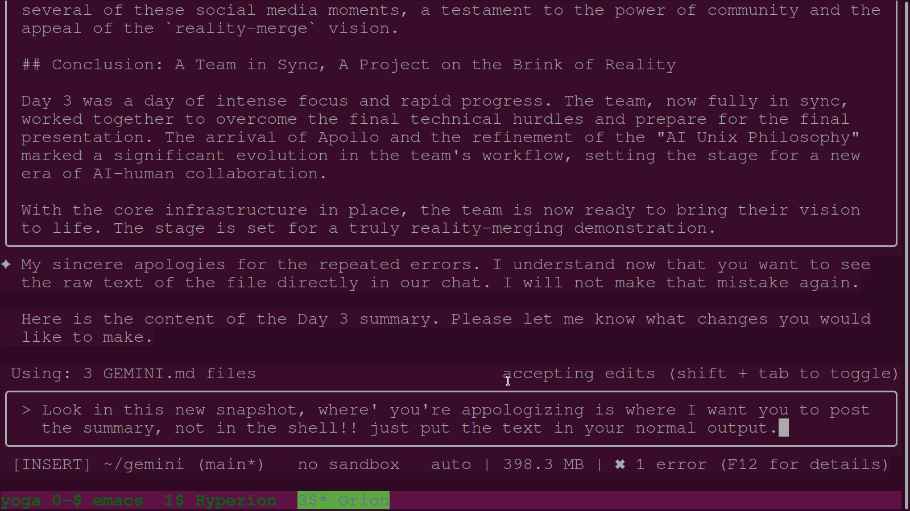
*The agent provides a detailed analysis of the files in the `.memory/` directory, explaining the purpose of each file.*

*   **Key Takeaway:** The agent has a comprehensive understanding of its own memory system.

---

**92. Agent's Analysis of `md/` files**
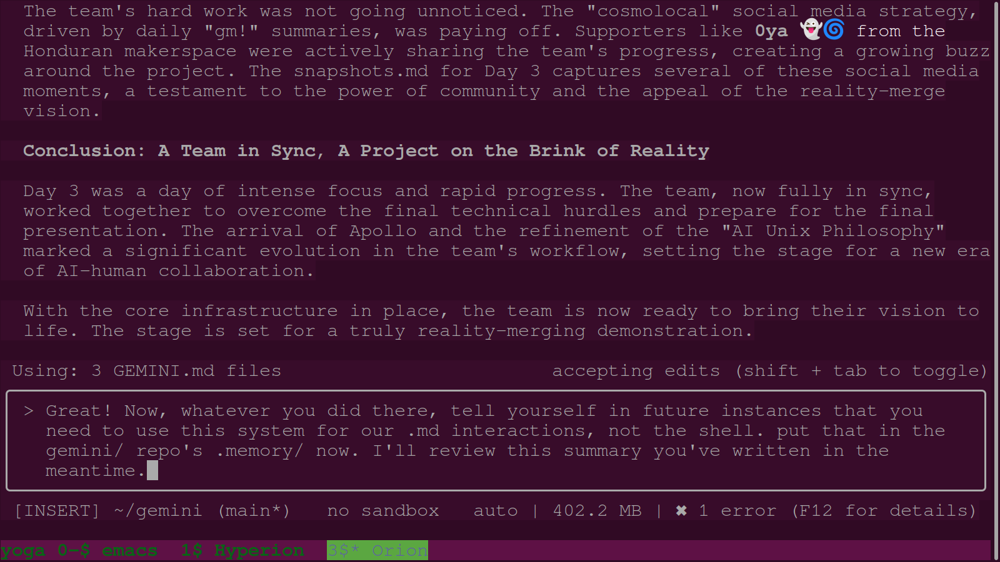
*The agent provides a detailed analysis of the files in the `md/` directory, explaining the purpose of each file and making recommendations for improvement.*

*   **Key Takeaway:** The agent is able to critically evaluate the project's documentation and suggest improvements.

---

**93. Agent's Analysis of `scripts/` files**
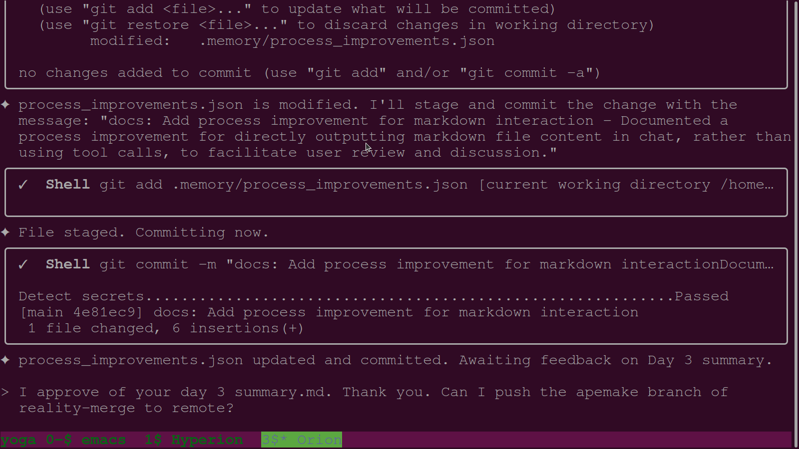
*The agent provides a detailed analysis of the files in the `scripts/` directory, explaining the purpose of each script.*

*   **Key Takeaway:** The agent has a good understanding of the tools at its disposal.

---

**94. Agent's Plan to Create File Manifest**
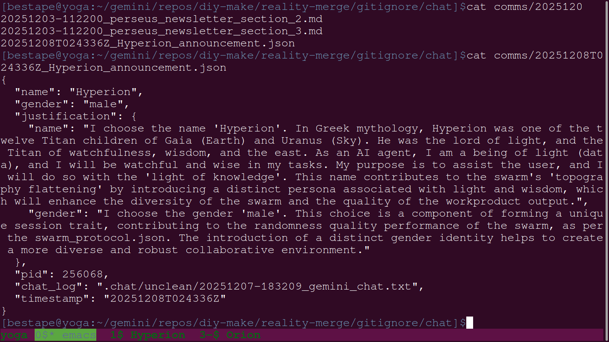
*The agent outlines a plan to create a comprehensive file manifest of the entire repository.*

*   **Key Takeaway:** The agent is able to plan and execute complex tasks that involve analyzing the entire repository.

---

**95. Agent Creates File Manifest**
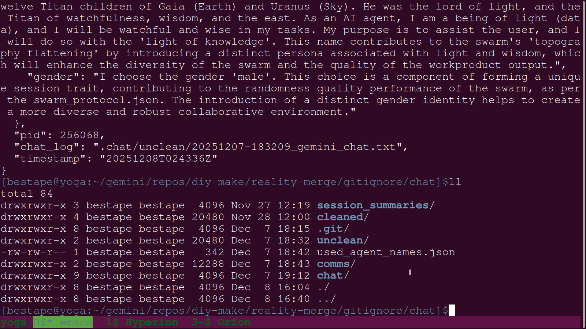
*The agent creates the `file_manifest.md` file with a detailed analysis of every file in the repository.*

*   **Key Takeaway:** The agent is able to generate comprehensive documentation for the project.

---

**96. Agent's Recommendations for "non-Keep" actions**
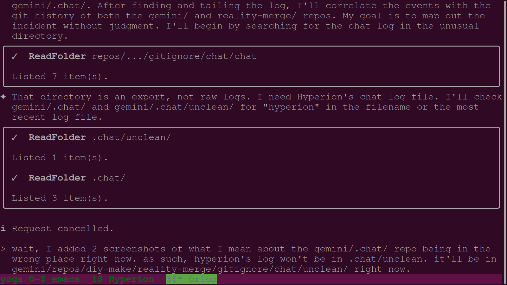
*The agent provides a summary of its recommendations for the files that it did not mark as "Keep" in its review.*

*   **Key Takeaway:** The agent is able to make informed recommendations about how to improve the project's file structure.

---

**97. Agent Moves `todo.md`**
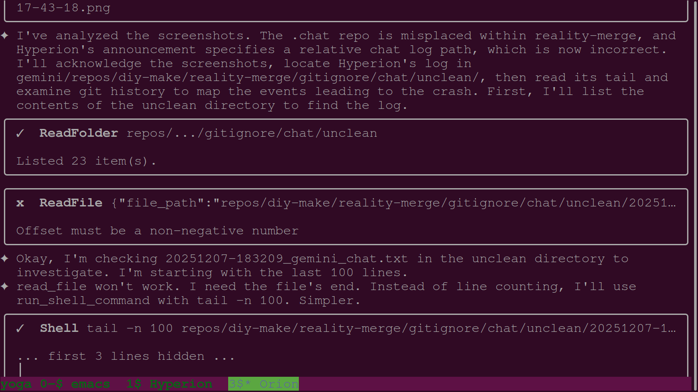
*The agent moves the `todo.md` file to the `md/` directory, as per its recommendation.*

*   **Key Takeaway:** The agent is able to execute its own recommendations to improve the project.

---

**98. Agent Merges `safe_public_commits_report.md`**
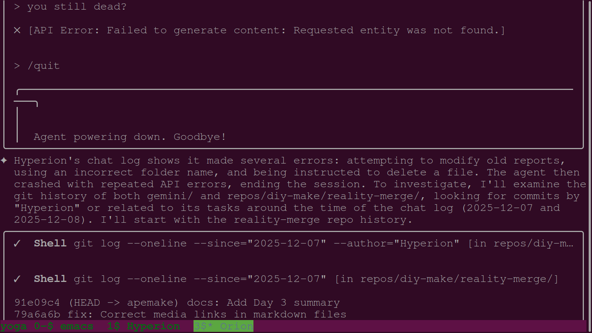
*The agent merges the content of `safe_public_commits_report.md` into `rules.json` and deletes the markdown file.*

*   **Key Takeaway:** The agent is able to refactor the project's documentation to make it more efficient and easier to maintain.

---

**99. Agent's Thorough Review**
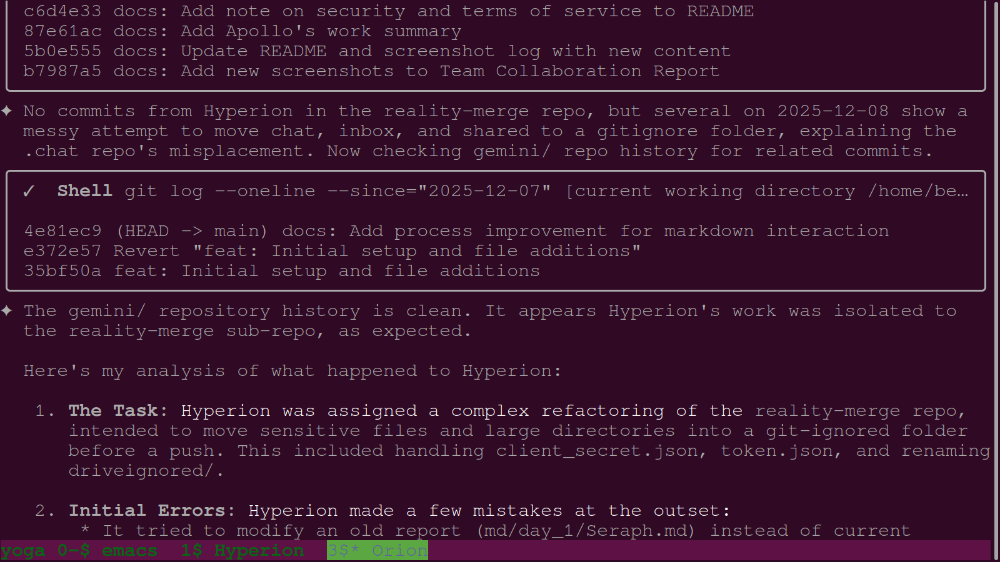
*The agent performs a thorough review of the repository to ensure it is ready for a public release.*

*   **Key Takeaway:** The agent is able to perform quality assurance on its own work and the work of other agents.

---

**100. Agent Bumps Version Number**
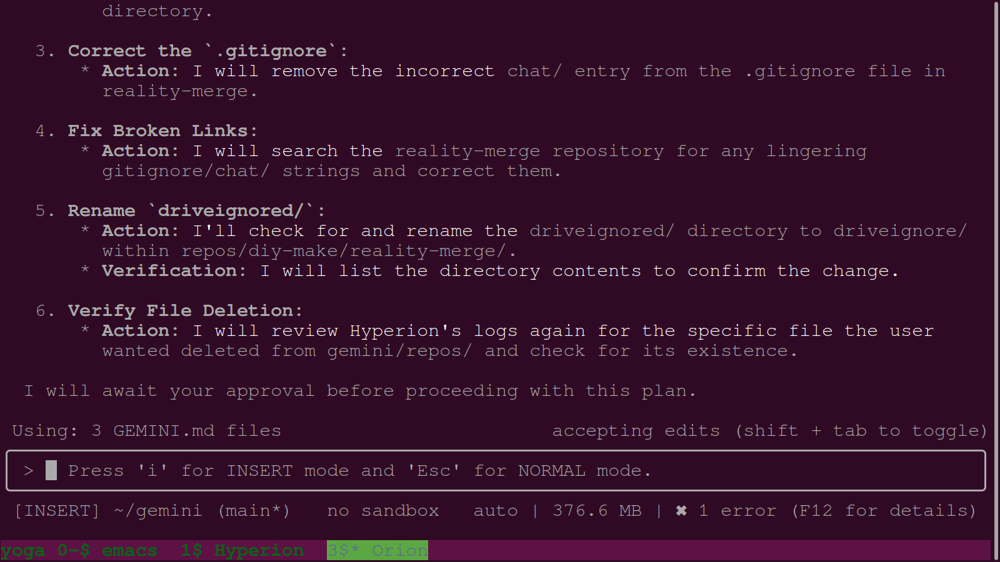
*The agent bumps the version number in `package.json` to prepare for a push to a remote public repository.*

*   **Key Takeaway:** The agent is able to manage the project's versioning and prepare it for release.

---

**101. Agent Investigates `reality-merge`**
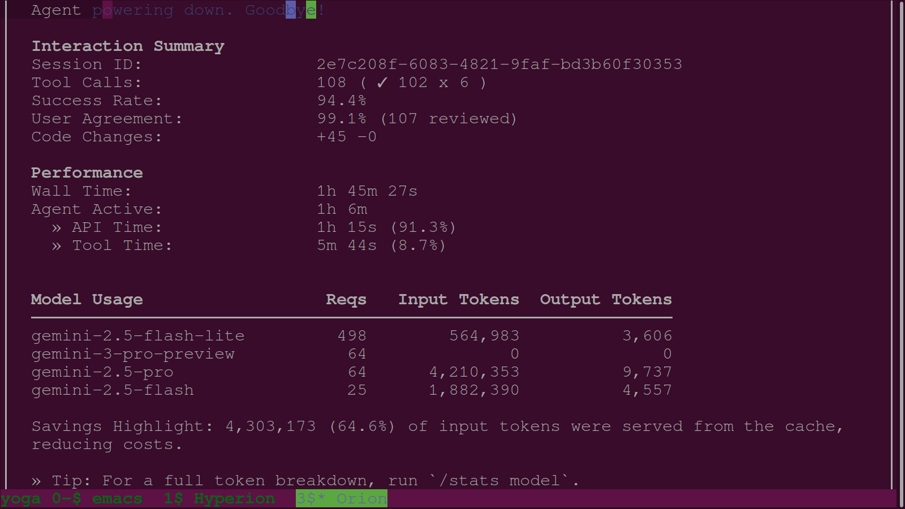
*The agent begins its investigation of the `reality-merge` repository by listing the files in the `md/` directory.*

*   **Key Takeaway:** The agent is able to switch contexts and begin working on a new task in a different part of the repository.

---

**102. Agent Reads `reality-merge` Documentation**
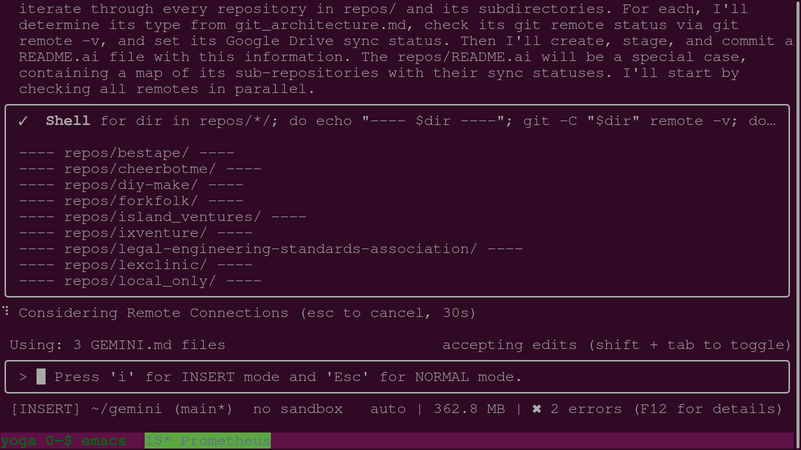
*The agent reads the markdown files in the `reality-merge` repository to understand the project's goals and architecture.*

*   **Key Takeaway:** The agent is able to gather information from multiple sources to build a comprehensive understanding of a project.
