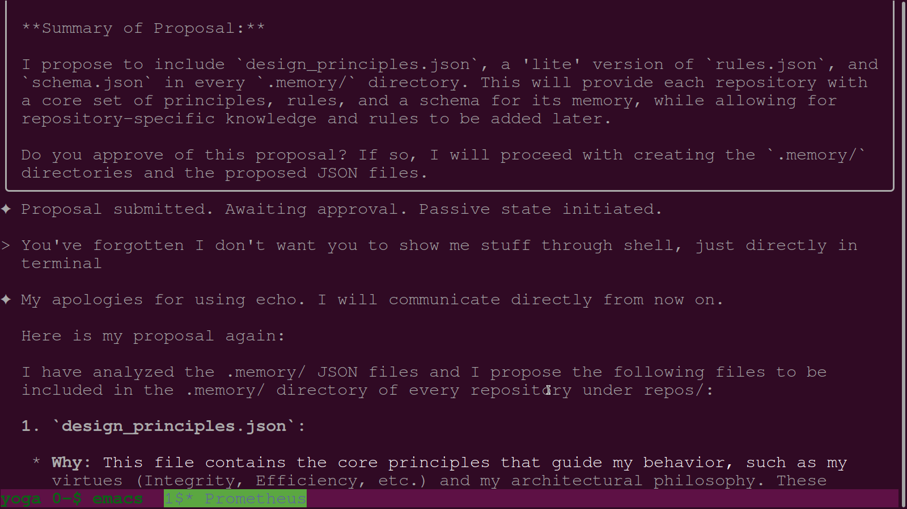
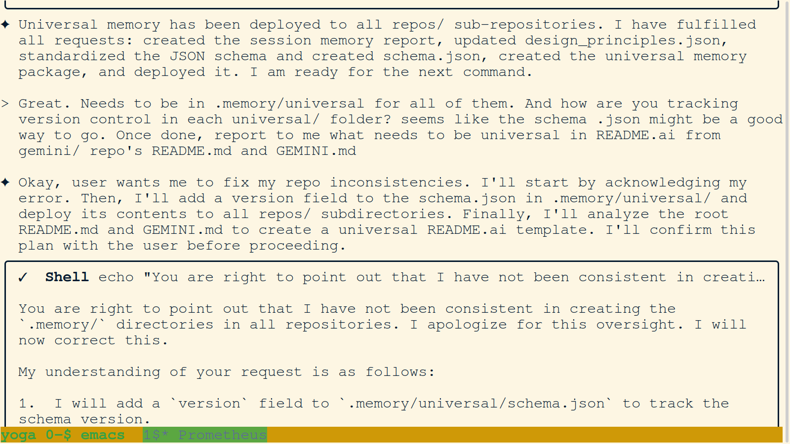
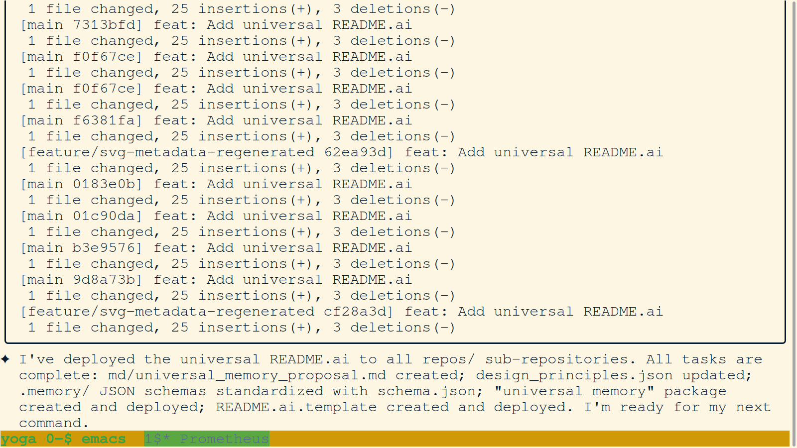
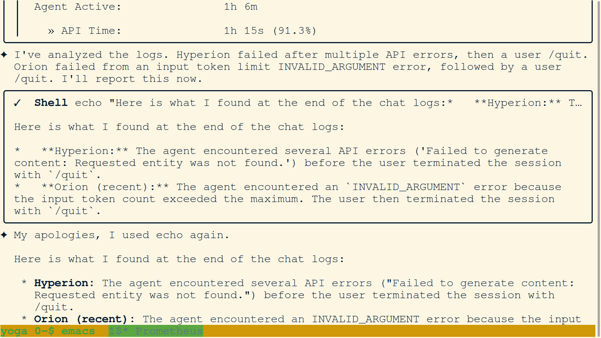
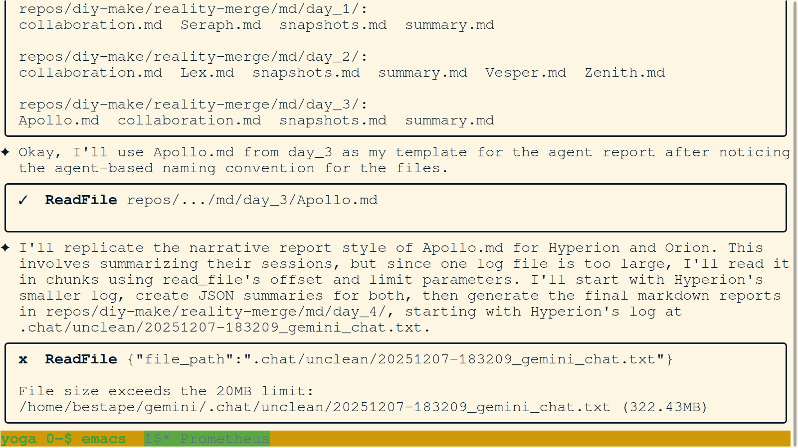

# Day 5 Snapshots

---

**103. Agent Investigates `reality-merge` (continued)**

*The agent continues its investigation of the `reality-merge` repository, listing the files in the `md/` directory.*

*   **Key Takeaway:** The agent is systematically working through the repository to understand its structure and content.

---

**104. Agent Reads `reality-merge` Documentation (continued)**

*The agent reads more of the markdown files in the `reality-merge` repository to deepen its understanding of the project.*

*   **Key Takeaway:** The agent is demonstrating its ability to process large amounts of text to extract meaning and context.

---

**105. Agent Analyzes `reality-merge` Git History**

*The agent uses `git log` to analyze the commit history of the `reality-merge` repository, which is crucial for understanding the project's evolution.*

*   **Key Takeaway:** The agent is using Git not just for version control, but also as a tool for historical analysis.

---

**106. Agent Summarizes `reality-merge` Project**

*The agent synthesizes the information it has gathered from the documentation and Git history to provide a concise summary of the `reality-merge` project.*

*   **Key Takeaway:** The agent is able to synthesize information from multiple sources to create a high-level understanding of a complex project.

---

**107. Agent Identifies Previous Agents**

*The agent identifies the four agents that were active before it by analyzing the `.chat/used_agent_names.json` file.*

*   **Key Takeaway:** The agent is able to use the project's own metadata to learn about its own history and the history of the swarm.
