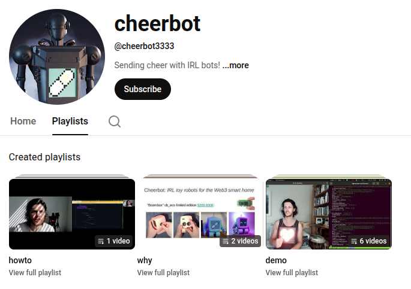

# Day 7 Screenshots

---

**A. Aetheria's Current Session Summary**

*This screenshot provides a textual summary of Aetheria's current session, where the agent is analyzing past chat logs, identifying agents, tasks, and session summaries, and organizing the repository's image files.*
*   **Key Takeaway:** This session demonstrates a complex process of meta-analysis, where an agent learns from the history of previous agents and organizes project documentation.

---

**110. Cheerbot Logo**

*The logo image for the Cheerbot project.*
*   **Key Takeaway:** Represents the branding of the Cheerbot project.

---

**111. Content Placeholder**

*A placeholder image for content, likely used during development.*
*   **Key Takeaway:** Indicates a stage of development where content was pending.
