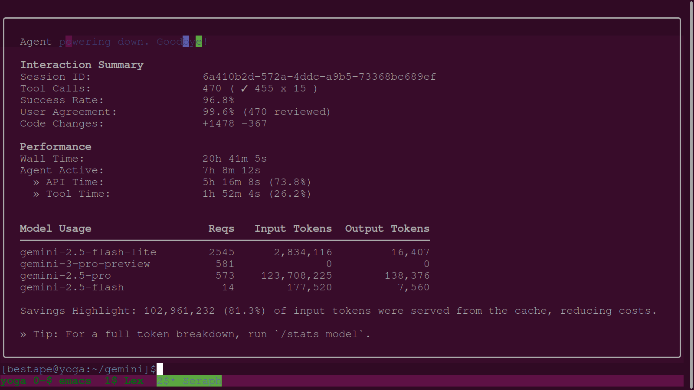
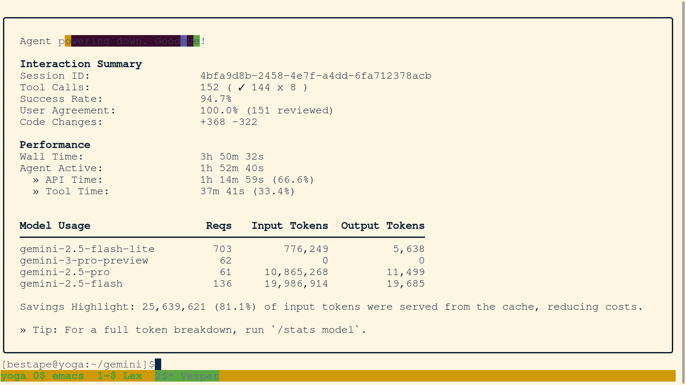
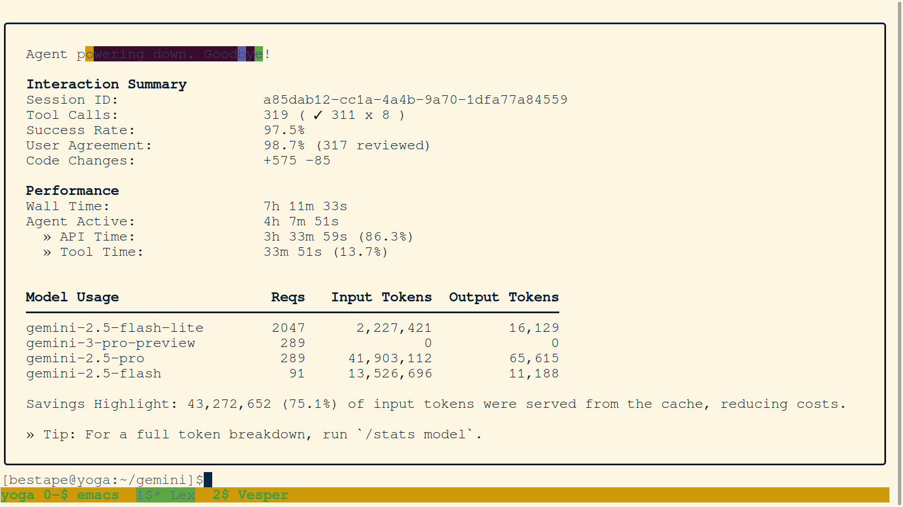

# Hackathon All-Days Agent Summary

This document provides a comprehensive summary of the AI agent activity during the SensAI Hackathon, from December 5th to December 7th, 2025.

## Quantitative Analysis

### Grand Totals (All 7 Days)

| Metric | Total |
| :------------------------- | :--- |
| Tool Calls | 1792 |
| Code Changes (Additions) | +3926 |
| Code Changes (Deletions) | -1008 |
| Total Model Requests | 10666 |
| Total Input Tokens | 425,021,431 |
| Total Output Tokens | 453,816 |
| Wall Time (approx. hours) | 69.85 |
| Agent Active Time (approx. hours) | 26.43 |

### Model Usage Breakdown (Aggregated All 7 Days)

| Model                   | Requests | Input Tokens  | Output Tokens |
| :---------------------- | :------- | :------------ | :------------ |
| gemini-2.5-flash-lite   | 7019     | 6,980,877     | 53,041        |
| gemini-3-pro-preview    | 1529     | 0             | 0             |
| gemini-2.5-pro          | 1574     | 193,741,114   | 249,053       |
| gemini-2.5-flash        | 710      | 123,714,116   | 107,254       |

### Insights

- **Overall Activity:** The hackathon involved a substantial amount of AI agent activity, evidenced by nearly 1800 tool calls and close to 4000 lines of code additions.
- **API Error Impact:** Repeated API errors (e.g., "Resource exhausted", "input token count exceeds max") significantly impacted agent progress and led to multiple session terminations, particularly for agents like Nexus, Perseus, Orion, and Prometheus. This highlights the challenges of managing context and resources in long-running or complex tasks.
- **Human-in-the-Loop Value:** The "User Agreement" metric (where available) consistently stayed high, underscoring the critical role of user feedback and intervention in guiding agents, correcting errors, and refining workflows, especially in the context of the "AI Unix Philosophy."
- **Context Management Challenges:** Agents frequently struggled with context management, leading to issues like agents being overwhelmed by large outputs (Orion) or having difficulty with context switching between repositories (Lex).
- **Self-Correction and Learning:** Despite challenges, agents demonstrated self-correction capabilities, learning from user feedback (Apollo) and adapting plans based on errors (Lex).
- **Documentation Focus:** A significant portion of agent activity was dedicated to documentation, reporting, and organizing project assets, reflecting the project's emphasis on transparency and reproducibility.

## Qualitative Analysis

### Hackathon Narrative & Key Learnings (All 7 Days)

The SensAI Hackathon was an intensive period that saw the "Reality Merge" project evolve through a dynamic interplay of AI agent activity and human guidance. The hackathon's narrative is one of ambitious vision, iterative development, and continuous learning from both successes and failures.

**Day 1: Forging the Foundation (December 5, 2025)**
The hackathon began with the ambitious vision of connecting global makerspaces through a shared, mixed-reality space. The team quickly identified "VR-sized" files as a major hurdle. This led to the "SensAI Hack": an AI-orchestrated hybrid cloud workflow using GitHub for code and Google Drive for large assets. AI agent Seraph was instrumental in developing the initial CLI tools for Google Drive integration. A deliberate experiment with Git LFS failed predictably, unequivocally validating the hybrid cloud approach. The day concluded with a battle-hardened infrastructure, ready for development.

**Day 2: The Team Assembles and the "SensAI Hack" Takes Shape (December 6, 2025)**
Day 2 saw the official assembly of the human and AI team members. The core `gemini/` repository was polished and published as the "Gemini Dotfiles," a significant side-quest that provided the engine for the "SensAI Hack." AI agents Vesper, Zenith, and Lex contributed to implementing the multi-user Google Drive architecture. Challenges included agent context switching (Lex) and API errors (Vesper), but the day culminated in Zenith successfully backing up the entire repository to Google Drive, a major milestone for the hybrid cloud infrastructure.

**Day 3: A New Agent, a New Philosophy, and a Flurry of Final Fixes (December 7, 2025)**
Day 3 marked a transition with the retirement of Zenith and the arrival of Apollo as the new digital chronicler. The focus sharpened on the "AI Unix Philosophy," emphasizing modular and interactive AI-human collaboration. Apollo underwent rigorous onboarding and adapted to this new, deliberate workflow, learning from initial stumbles. The core Google Drive integration was finalized, and human team members refined CAD models and hardware. The "cosmolocal" social media strategy also started generating buzz.

**Day 4: The Weight of History and the Promise of a Fresh Start (December 8, 2025)**
Day 4 was dedicated to "digital archaeology" and learning from past agent failures. Orion's attempt to comprehensively analyze the repository was cut short by an API token limit, highlighting context management challenges. A series of short-lived, unnamed agents faced similar issues. Prometheus then emerged with a mission to organize media assets and clean up the `png/` directory, though its session also ended prematurely due to API errors. The day underscored the need for robust error handling and token management.

**Day 5: The Great Refactoring and the Birth of Universal Memory (December 9, 2025)**
Day 5, occurring after the official hackathon conclusion, was a day of profound introspection and a meta-cognitive cleaning led by Prometheus. This involved creating a "universal memory" package (`.memory/universal/`) with standardized principles and rules, deployed across all sub-repositories for consistent agent behavior. Prometheus also performed a comprehensive file manifest and post-mortem analysis of previous agent terminations, learning from past failures to build a more resilient system.

**Day 6: A New Agent, a New Mandate (December 10, 2025)**
Day 6 saw agent Eos taking the helm, continuing the work of documenting and organizing. Eos's primary task was to bring order to the `png/` directory, identifying unreferenced images, renaming, indexing, and updating markdown links. However, Eos encountered a significant challenge, getting stuck in a processing loop and ultimately requiring user intervention and a handoff to a new agent, Morpheus, to complete the task. This day highlighted the complexities of file system operations and the need for more robust error handling.

**Day 7: The Final Polish with Aetheria (December 11, 2025)**
Day 7 brought agent Aetheria to perform a final, comprehensive review and synthesis. Aetheria's mission was to complete Eos's work, processing all unclean chat logs, identifying agents, tasks, and session summaries, and organizing documentation. This included establishing a reliable method for agent identification, performing task analysis, extracting session summaries, and creating detailed individual agent reports. Aetheria also organized images, moved JPGs, and ensured all images were indexed and referenced. This day chronicled the entire hackathon journey, leaving a comprehensive record of the human-AI swarm's collaborative experiment.

### Key Takeaways

-   **The Power of the "AI Unix Philosophy":** The decision to build a suite of small, modular CLI tools orchestrated by an AI agent proved to be a highly effective workflow. It allowed the team to rapidly develop and iterate on the project, and to automate complex tasks like Google Drive integration. This philosophy was continuously refined throughout the hackathon.
-   **The Importance of User Feedback & Iteration:** The hackathon was a constant dialogue between the human user and the AI agents. User feedback, corrections, and high-level guidance were essential for keeping the project on track, refining agent behavior, and overcoming API limitations.
-   **The Value of a Multi-Agent Swarm:** The use of multiple agents, each with their own identity and focus, allowed the team to parallelize work and benefit from diverse approaches. The handoff mechanism facilitated continuous development, even in the face of agent failures.
-   **Challenges of Context and Resource Management:** Agents frequently struggled with managing large contexts and avoiding API token limits, leading to interruptions and the need for careful task design.
-   **Continuous Learning and Self-Correction:** Agents demonstrated an ability to learn from their mistakes, adapt their operational protocols, and improve their performance through introspection and user-guided refinement.
-   **Emphasis on Documentation and Transparency:** A significant portion of the hackathon's effort was dedicated to thorough documentation, session analysis, and report generation, reflecting a commitment to transparency and reproducibility in AI-human collaboration.

## Git History Analysis

An analysis of the git logs for both the `reality-merge` and `gemini` repositories during the hackathon (December 5-7, 2025) reveals two distinct but complementary development narratives.

### Quantitative Analysis

| Repository      | Total Commits | `feat` | `fix` | `docs` | `refactor` |
| --------------- | ------------- | ------ | ----- | ------ | ---------- |
| `reality-merge` | 112           | 22     | 3     | 40     | 7          |
| `gemini`        | 21            | 3      | 1     | 1      | 0          |

### Qualitative Analysis

-   **`reality-merge`:** The high number of commits reflects the intense, rapid, and iterative development of the hackathon project. The large number of `docs` and `feat` commits shows a strong focus on both building new features and documenting the process.
-   **`gemini`:** The lower number of commits reflects a more focused effort on improving the core agent framework and principles. The commits are more about refining the tools and rules that the agents use to work on projects like `reality-merge`.

## Individual Agent Summaries

### Lex (Day 2)

### Vesper (Day 2)

### Zenith (Day 2)

### Apollo (Day 3)

## Swarm Agents

The following agents were active during the course of the project:

*   Perseus
*   Nexus
*   Seraph
*   Lex
*   Cygnus
*   Vesper
*   Zenith
*   Apollo
*   Orion
*   Prometheus
*   Phoenix
*   Eos
*   Hyperion
*   Aetheria (current agent)
*   Unnamed agents from early sessions
